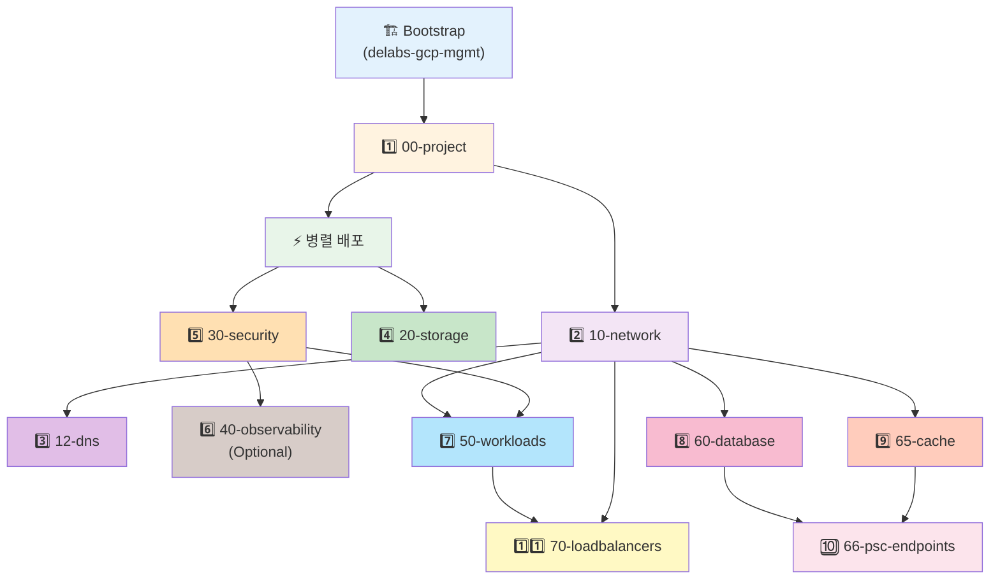
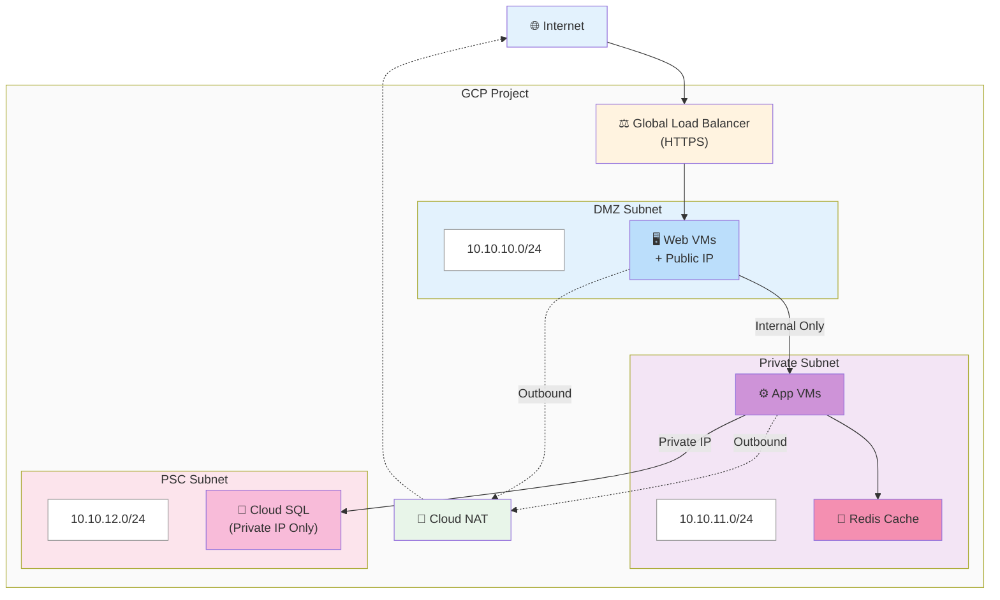

# GCP Terraform Infrastructure

Google Cloud Platform 인프라를 위한 프로덕션 레디 Terraform 모듈 및 환경 구성.

## 🚀 빠른 시작 (5분 가이드)

### 1️⃣ Bootstrap 설정 (최초 1회만)
```bash
cd bootstrap
terraform init && terraform apply

# 인증 설정
gcloud auth application-default set-quota-project YOUR_MGMT_PROJECT
```
📖 [Bootstrap 상세 가이드](./docs/getting-started/bootstrap-setup.md)

### 2️⃣ 첫 프로젝트 배포

**Jenkins 사용 (권장)**
```
TARGET_LAYER: all
ACTION: apply
ENABLE_OBSERVABILITY: true
```

**수동 배포**
```bash
cd environments/LIVE/gcp-gcby/00-project
terragrunt init --non-interactive
terragrunt plan
terragrunt apply
```

### 3️⃣ 결과 확인
```bash
terragrunt output -json | jq
```

📖 [첫 배포 가이드](./docs/getting-started/first-deployment.md)

## 📁 프로젝트 구조

```
terraform_gcp_infra/
├── bootstrap/              # 중앙 State 관리 (최우선 배포)
├── modules/                # 재사용 가능한 모듈 (12개)
├── environments/           # 환경별 배포
│   └── LIVE/
│       └── gcp-gcby/    # 프로덕션 환경
└── proj-default-templet/   # 새 환경용 템플릿 (Jenkins에서 복사)
```

## 🔄 Phase 기반 배포 시스템

Jenkins CI/CD는 9개 Phase로 인프라를 순차 배포하여 의존성을 자동 해결합니다:

| Phase | 레이어 | 설명 | Optional |
|-------|--------|------|----------|
| **Phase 1** | `00-project` | GCP 프로젝트 생성 | ❌ |
| **Phase 2** | `10-network` | VPC 네트워킹 구성 | ❌ |
| **Phase 3** | `12-dns` | Cloud DNS (Public/Private) | ❌ |
| **Phase 4** | `20-storage`<br>`30-security` | 스토리지 및 IAM 보안 | ❌ |
| **Phase 5** | `40-observability` | Logging/Monitoring/Slack 알림 | ✅ |
| **Phase 6** | `50-workloads` | VM 인스턴스 배포 | ❌ |
| **Phase 7** | `60-database`<br>`65-cache` | Cloud SQL + Redis 캐시 | ❌ |
| **Phase 8** | `66-psc-endpoints` | Cross-project PSC 등록 | ❌ |
| **Phase 9** | `70-loadbalancers/gs` | 로드밸런서 (Game Server) | ❌ |

### 주요 특징
- ✅ **전체 승인 한 번**: `TARGET_LAYER=all` 시 모든 Phase를 한 번에 승인
- ✅ **Stale Plan 방지**: Apply 직전 Re-plan으로 최신 상태 보장
- ✅ **Mock Outputs 해결**: Phase 순차 실행으로 순환 참조 문제 근본 해결
- ✅ **Optional Phase**: 40-observability는 선택 가능 (destroy 시엔 항상 포함)

📖 [Phase 기반 배포 가이드](./docs/guides/jenkins-cicd.md)

## 🤖 스마트 자동화 기능

### 1. 서브넷 자동 매핑 (50-workloads)
```hcl
# ❌ 기존 방식 (하드코딩)
subnetwork_self_link = "projects/gcp-gcby/regions/us-west1/subnetworks/gcby-subnet-dmz"

# ✅ 새로운 방식 (subnet_type만 지정)
subnet_type = "dmz"  # 10-network outputs에서 자동 매핑
```

### 2. Zone 자동 변환 (50-workloads)
```hcl
# ❌ 기존 방식 (전체 zone 경로 입력)
zone = "us-west1-a"

# ✅ 새로운 방식 (zone_suffix만 지정)
zone_suffix = "a"  # region_primary와 자동 결합 → us-west1-a
```

**멀티 존 고가용성 구성 예시**:
```hcl
instances = {
  "web-01" = { zone_suffix = "a", subnet_type = "dmz" }
  "web-02" = { zone_suffix = "b", subnet_type = "dmz" }
  "web-03" = { zone_suffix = "c", subnet_type = "dmz" }
}
```

### 3. GCS Bucket Location 자동화 (20-storage)
```hcl
# region_primary만 설정하면 자동 생성
# - assets/logs 버킷: Same-region 배치 (무료 트래픽)
# - backups 버킷: Multi-region 배치 (DR 목적)
```

### 4. 네이밍 일관성 (modules/naming)
```hcl
# project_name만 설정하면 모든 리소스명 자동 생성
# 예: project_name="game-n" → "game-n-subnet-dmz", "game-n-web-backend" 등
```

## 🏗️ 인프라 레이어 (11단계)

### 의존성 그래프



### 레이어별 상세

| 레이어 | 목적 | 주요 리소스 | 의존성 |
|--------|------|------------|--------|
| `00-project` | GCP 프로젝트 생성 | Project, API 활성화, Billing, 예산 알림 | Bootstrap |
| `10-network` | VPC 네트워킹 | VPC, Subnet(DMZ/Private/DB), Firewall, Cloud NAT, PSC | 00-project |
| `12-dns` | Cloud DNS | Public/Private DNS Zone, DNS 레코드, DNSSEC, DNS Peering | 10-network |
| `20-storage` | GCS 버킷 관리 | Assets/Logs/Backups 버킷, Lifecycle, CORS | 10-network |
| `30-security` | IAM 및 Service Account | IAM 바인딩, 서비스 계정(compute, monitoring, deployment) | 10-network |
| `40-observability` | Logging/Monitoring | Log Sink, Dashboard, Alert 정책, Slack 알림 | 10-network, 30-security |
| `50-workloads` | VM 인스턴스 | GCE VMs, Instance Groups, 부팅 디스크 | 10-network, 30-security |
| `60-database` | Cloud SQL | MySQL HA, 읽기 복제본, PITR, Private IP | 10-network |
| `65-cache` | Redis 캐시 | Memorystore Redis (Standard HA / Enterprise) | 10-network |
| `66-psc-endpoints` | Cross-project PSC | mgmt VPC에서 DB/Redis 접근용 PSC 등록 | 60-database, 65-cache |
| `70-loadbalancers/gs` | Load Balancer | HTTP LB, Instance Group 자동 처리, Backend cleanup 스크립트 | 50-workloads |

## 🏛️ 네트워크 아키텍처

### 3-Tier 보안 분리



### 보안 원칙
- ✅ DMZ 서브넷만 Public IP 허용
- ✅ Private 서브넷은 내부 통신만
- ✅ DB 서브넷은 Private IP + VPC Peering
- ✅ Cloud NAT로 아웃바운드 트래픽 처리

📖 [네트워크 설계 상세](./docs/architecture/network-design.md)

## 📚 문서

### 시작하기
- [사전 요구사항](./docs/getting-started/prerequisites.md) - Terraform/Terragrunt 설치, GCP 인증
- [Bootstrap 설정](./docs/getting-started/bootstrap-setup.md) - 중앙 State 관리 초기화
- [첫 배포](./docs/getting-started/first-deployment.md) - 단계별 배포 가이드
- [자주 쓰는 명령어](./docs/getting-started/quick-commands.md) - 명령어 치트시트

### 아키텍처
- [전체 구조](./docs/architecture/overview.md) - 프로젝트 아키텍처 개요
- [State 관리](./docs/architecture/state-management.md) - Terraform State 전략
- [네트워크 설계](./docs/architecture/network-design.md) - 3-Tier 네트워크 아키텍처
- [다이어그램 모음](./docs/architecture/diagrams.md) - Mermaid 다이어그램

### 가이드
- [새 프로젝트 추가](./docs/guides/adding-new-project.md) - 신규 환경 생성 가이드
- [Jenkins CI/CD](./docs/guides/jenkins-cicd.md) - Phase 기반 배포 가이드
- [Terragrunt 사용법](./docs/guides/terragrunt-usage.md) - Terragrunt 0.93+ 명령어
- [리소스 삭제 가이드](./docs/guides/destroy-guide.md) - Phase 역순 삭제 방법

### 운영
- [모니터링 설정 (Slack)](./docs/guides/monitoring-setup.md) - Alert 정책 및 Slack 통합
- [Jenkins GitHub 연동](./docs/guides/jenkins-github-setup.md) - Jenkins + GitHub 통합 설정

### 트러블슈팅
- [일반적인 오류](./docs/troubleshooting/common-errors.md) - Phase 기반 배포 문제 해결
- [State 문제](./docs/troubleshooting/state-issues.md) - State Lock, Drift 해결
- [네트워크 문제](./docs/troubleshooting/network-issues.md) - PSC, Cloud NAT 문제 해결

### 변경 이력
- [CHANGELOG](./docs/changelog/CHANGELOG.md) - 주요 변경사항 요약
- [작업 이력](./docs/changelog/work_history/) - 일별 상세 작업 로그

## ✨ 주요 기능

### 보안 우선
- ✅ DMZ/Private/DB 서브넷 3-Tier 분리
- ✅ Private IP only (Cloud SQL, Memorystore Redis)
- ✅ Shielded VM (Secure Boot, vTPM)
- ✅ Non-authoritative IAM 바인딩
- ✅ Private Service Connect (Cloud SQL, Redis Enterprise)

### 중앙 집중식 관리
- ✅ Bootstrap 기반 State 관리 (delabs-gcp-mgmt)
- ✅ `modules/naming`으로 일관된 네이밍 규칙
- ✅ Terragrunt로 DRY 원칙 적용
- ✅ 환경별 독립된 State 파일

### 프로덕션 레디
- ✅ 12개 재사용 가능 모듈
- ✅ Phase 기반 배포 시스템 (9단계)
- ✅ Jenkins CI/CD 통합 (GitOps)
- ✅ HA 구성 (Cloud SQL Regional, Redis Standard HA)
- ✅ 자동 백업 (PITR, GCS Lifecycle)

### 완전한 자동화
- ✅ 서브넷 자동 매핑 (subnet_type)
- ✅ GCS Location 자동 설정 (region_primary)
- ✅ 네이밍 자동 생성 (project_name 기반)
- ✅ Instance Group 자동 생성/삭제 (VM 기반)
- ✅ Backend cleanup 자동화 (Jenkins 통합)

### 완전한 문서화
- ✅ 12/12 모듈 README 포함
- ✅ 단계별 가이드 (Bootstrap → 배포 → 운영)
- ✅ 트러블슈팅 가이드 (Phase 기반)
- ✅ Mermaid 다이어그램

## 🔧 자주 쓰는 명령어

### Jenkins CI/CD (권장)
```
# 전체 인프라 배포 (Phase 1-8 순차 실행)
TARGET_LAYER: all
ACTION: apply
ENABLE_OBSERVABILITY: true

# 단일 레이어 배포
TARGET_LAYER: 50-workloads
ACTION: apply

# Dry-run 모드
TARGET_LAYER: all
ACTION: plan
```

### 수동 배포 (Terragrunt 0.93+)
```bash
# 단일 레이어
cd environments/LIVE/gcp-gcby/00-project
terragrunt init --non-interactive
terragrunt plan
terragrunt apply

# 전체 스택
cd environments/LIVE/gcp-gcby
terragrunt run --all -- plan
terragrunt run --all -- apply

# 특정 레이어만 포함
terragrunt run --all --queue-include-dir 50-workloads -- apply

# 특정 레이어 제외
terragrunt run --all --queue-exclude-dir 40-observability -- apply
```

### State 관리
```bash
# State 확인
terragrunt state list
terragrunt output -json | jq

# State Lock 해제
terragrunt force-unlock <LOCK_ID>

# State Drift 감지
terragrunt plan -detailed-exitcode
```

### 코드 포맷팅 및 검증
```bash
# 포맷팅
terraform fmt -recursive

# 검증
terraform validate

# 의존성 그래프 생성
terragrunt graph-dependencies | dot -Tpng > graph.png
```

📖 [전체 명령어 치트시트](./docs/getting-started/quick-commands.md)

## 📦 재사용 가능한 모듈 (12개)

| 모듈 | 기능 | 주요 특징 | 문서 |
|------|------|----------|------|
| **naming** | 중앙 집중식 네이밍 | 일관된 리소스명 자동 생성 | [문서](./docs/modules/naming.md) |
| **project-base** | GCP 프로젝트 생성 | API 활성화, Billing, 예산 알림 | [문서](./docs/modules/project-base.md) |
| **network-dedicated-vpc** | VPC 네트워킹 | DMZ/Private/DB 서브넷, Firewall, Cloud NAT, PSC | [문서](./docs/modules/network-dedicated-vpc.md) |
| **cloud-dns** | Cloud DNS | Public/Private Zone, DNSSEC, DNS Peering | [문서](./docs/modules/cloud-dns.md) |
| **gcs-root** | 다중 버킷 관리 | Assets/Logs/Backups 버킷, Lifecycle | [문서](./docs/modules/gcs-root.md) |
| **gcs-bucket** | 단일 버킷 설정 | CORS, Versioning, IAM | [문서](./docs/modules/gcs-bucket.md) |
| **iam** | IAM 관리 | Non-authoritative 바인딩, 서비스 계정 | [문서](./docs/modules/iam.md) |
| **observability** | Logging/Monitoring | Log Sink, Dashboard, Alert, Slack | [문서](./docs/modules/observability.md) |
| **gce-vmset** | VM 인스턴스 | Shielded VM, Instance Groups, subnet_type | [문서](./docs/modules/gce-vmset.md) |
| **cloudsql-mysql** | MySQL DB | Regional HA, PITR, Private IP, 읽기 복제본 | [문서](./docs/modules/cloudsql-mysql.md) |
| **memorystore-redis** | Redis 캐시 | Standard HA / Enterprise (PSC) | [문서](./docs/modules/memorystore-redis.md) |
| **load-balancer** | Load Balancer | Global LB, Backend Service, Health Check | [문서](./docs/modules/load-balancer.md) |

> 전체 모듈 목록: [docs/modules/README.md](./docs/modules/README.md)

## 🆕 새 환경 추가

### Jenkins 사용 (자동화)
```groovy
// Jenkinsfile.create-project 실행
PROJECT_NAME: my-new-project
ENVIRONMENT: LIVE
```

### 수동 생성
```bash
# 1. 템플릿 복사
cp -r proj-default-templet environments/LIVE/my-new-project

# 2. 네이밍 설정 수정
cd environments/LIVE/my-new-project
vim common.naming.tfvars
# project_name, project_id, region_primary, environment 수정

# 3. Phase 순서대로 배포 (Jenkins 사용 권장)
cd 00-project && terragrunt apply
cd ../10-network && terragrunt apply
cd ../12-dns && terragrunt apply
cd ../20-storage && terragrunt apply
cd ../30-security && terragrunt apply
cd ../40-observability && terragrunt apply
cd ../50-workloads && terragrunt apply
cd ../60-database && terragrunt apply
cd ../65-cache && terragrunt apply
cd ../66-psc-endpoints && terragrunt apply
cd ../70-loadbalancers/gs && terragrunt apply
```

📖 [상세 가이드](./docs/guides/adding-new-project.md)

## 🎯 모범 사례

### 배포 순서 준수
1. **Bootstrap 최우선**: 모든 환경의 State 관리 기반
2. **Phase 순서대로**: 의존성 자동 해결 (00 → 10 → 12 → 20 → ... → 70)
3. **Jenkins 사용**: Phase 기반 배포로 Mock outputs 문제 회피

### State 관리
- ✅ 환경별 독립된 State 파일 유지
- ✅ `gcloud auth application-default set-quota-project YOUR_MGMT_PROJECT` 인증 설정
- ✅ State Lock은 자동 처리 (GCS Object Lock)

### 보안 원칙
- ✅ DB/Redis는 Private IP only
- ✅ DMZ 서브넷에만 Public IP 허용
- ✅ Service Account 권한 최소화 (Principle of Least Privilege)
- ✅ Shielded VM (Secure Boot, vTPM, Integrity Monitoring)

### 코드 품질
- ✅ `terraform fmt` 실행 후 커밋
- ✅ `terraform validate` 통과 확인
- ✅ `terraform.tfvars.example` 제공
- ✅ 모듈별 README.md 포함

## 🔍 트러블슈팅

### "storage: bucket doesn't exist" 오류
```bash
# 원인: Bootstrap State 버킷 접근 권한 없음
# 해결: ADC 인증 설정
gcloud auth application-default set-quota-project YOUR_MGMT_PROJECT
```

### State Lock 발생
```bash
# 원인: 이전 실행이 중단되어 Lock이 남음
# 해결: Lock 강제 해제
terragrunt force-unlock <LOCK_ID>
```

### API 미활성화 오류
```bash
# 원인: GCP API가 활성화되지 않음
# 해결: 00-project 레이어 먼저 배포 (API 자동 활성화)
cd 00-project && terragrunt apply

# 또는 수동 활성화
gcloud services enable compute.googleapis.com \
    servicenetworking.googleapis.com \
    --project=<PROJECT_ID>
```

### Mock outputs 404 에러
```bash
# 원인: 10-network 미적용 상태에서 50-workloads가 mock 서브넷 참조
# 해결: Phase 기반 배포 사용 (Jenkins에서 TARGET_LAYER=all)
# Phase 순서대로 apply하므로 10-network가 먼저 적용됨
```

### Stale plan 에러
```bash
# 원인: Plan 생성 후 다른 Phase가 State를 변경함
# 해결: Phase 기반 배포는 Apply 직전 Re-plan 실행 (자동)
# 수동 배포 시에는 plan과 apply를 연속 실행
terragrunt plan -out=tfplan && terragrunt apply tfplan
```

### Instance Group 삭제 시 resourceInUseByAnotherResource 에러
```bash
# 원인: Backend Service가 Instance Group을 사용 중
# 해결: Jenkins가 Phase 8 apply 전에 cleanup 스크립트 자동 실행
# 수동 실행 시:
cd 70-loadbalancers/gs
./cleanup_backends.sh  # Backend에서 Instance Group 제거
terragrunt apply       # 안전하게 apply
```

📖 [전체 트러블슈팅 가이드](./docs/troubleshooting/common-errors.md)

## 🤝 기여하기

### 모듈 개발
1. 모듈 구조 따르기 (variables.tf, outputs.tf, main.tf, README.md)
2. `terraform.tfvars.example` 제공
3. `terraform fmt -recursive` 실행
4. `terraform validate` 통과
5. README.md에 Usage 예제 포함

### 문서 업데이트
1. Mermaid 다이어그램 사용 (아키텍처 설명)
2. 코드 블록에 언어 지정 (bash, hcl, json 등)
3. 링크는 상대 경로 사용 (`./docs/...`)
4. 작업 이력은 `docs/changelog/work_history/YYYY-MM-DD.md`에 기록

### 코드 리뷰
1. Phase 의존성 검증
2. subnet_type 자동화 적용 확인
3. 네이밍 규칙 준수 (`modules/naming` 사용)
4. 보안 원칙 준수 (Private IP, IAM 최소 권한 등)

## 🔗 참고 자료

### 공식 문서
- [Terraform GCP Provider](https://registry.terraform.io/providers/hashicorp/google/latest/docs)
- [Terragrunt 0.93+ 문서](https://terragrunt.gruntwork.io/docs/)
- [GCP Best Practices](https://cloud.google.com/architecture/framework)

### 내부 문서
- [CREATE_NEW_PROJECT.md](./docs/CREATE_NEW_PROJECT.md) - 프로젝트 생성 상세 가이드
- [REORGANIZATION_SUMMARY.md](./docs/REORGANIZATION_SUMMARY.md) - 문서 재구성 히스토리

## 📞 지원

- [GitHub Issues](https://github.com/your-org/terraform-gcp-infra/issues)
- [문서 포털](./docs/)
- [작업 이력](./docs/changelog/work_history/)

---

**Made by 433 IT_infra_dept**
**Last Updated: 2025-12-09**
