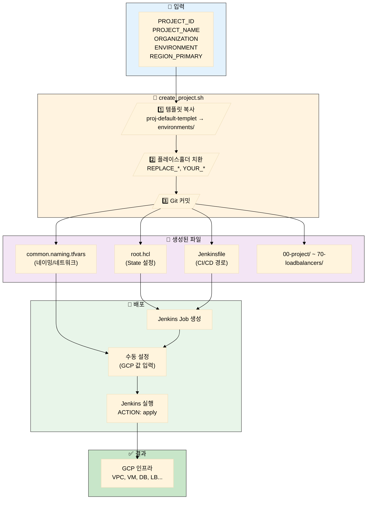

# 신규 프로젝트 생성 가이드

이 문서는 `proj-default-templet`을 기반으로 신규 GCP 프로젝트를 생성하는 방법을 설명합니다.

## 목차

- [개요](#개요)
- [사전 요구사항](#사전-요구사항)
- [방법 1: 스크립트 실행 (권장)](#방법-1-스크립트-실행-권장)
- [방법 2: 수동 생성](#방법-2-수동-생성)
- [생성 후 필수 설정](#생성-후-필수-설정)
- [Jenkins Job 생성](#jenkins-job-생성)
- [초기 배포](#초기-배포)
- [트러블슈팅](#트러블슈팅)

---

## 개요

`proj-default-templet`은 `gcp-gcby` 환경을 기반으로 구성된 템플릿입니다.

### 프로젝트 생성 플로우



신규 프로젝트 생성 시 다음 작업이 자동으로 수행됩니다:

1. `proj-default-templet` 디렉토리 복사
2. 필수 설정 파일 치환:
   - `root.hcl`: Terraform state 설정, GCP org/billing 정보
   - `common.naming.tfvars`: 프로젝트 ID, 이름, 조직, 리전
   - `Jenkinsfile`: TG_WORKING_DIR 경로, Credential ID
3. 현재 브랜치에 커밋

---

## 사전 요구사항

### 필수 정보

| 항목 | 설명 | 예시 |
|------|------|------|
| **PROJECT_ID** | GCP 프로젝트 ID (소문자/숫자/하이픈) | `gcp-newgame` |
| **PROJECT_NAME** | 프로젝트 이름 (리소스 네이밍용) | `newgame` |
| **ORGANIZATION** | 조직명 (리소스 접두어) | `delabs` |
| **ENVIRONMENT** | 배포 환경 | `LIVE`, `QA`, `STG` |
| **REGION_PRIMARY** | 주 리전 | `us-west1`, `asia-northeast3` |

### 템플릿 레이어 구조

```
proj-default-templet/
├── root.hcl                    # Terragrunt 루트 설정
├── common.naming.tfvars        # 공통 변수 (네이밍, 네트워크 등)
├── Jenkinsfile                 # CI/CD 파이프라인
├── 00-project/                 # GCP 프로젝트 생성
├── 10-network/                 # VPC, Subnet, Firewall
├── 12-dns/                     # Cloud DNS
├── 20-storage/                 # Cloud Storage
├── 30-security/                # IAM, Service Account
├── 40-observability/           # Monitoring, Logging
├── 50-workloads/               # VM 인스턴스
├── 60-database/                # Cloud SQL
├── 65-cache/                   # Memorystore Redis
└── 70-loadbalancers/gs/        # Load Balancer
```

---

## 방법 1: 스크립트 실행 (권장)

### 사용법

```bash
cd terraform_gcp_infra

./scripts/create_project.sh <PROJECT_ID> <PROJECT_NAME> <ORGANIZATION> <ENVIRONMENT> <REGION_PRIMARY>
```

### 예시

```bash
./scripts/create_project.sh gcp-newgame newgame delabs LIVE us-west1
```

### 스크립트 동작

1. `proj-default-templet` → `environments/{ENV}/{PROJECT_ID}`로 복사
2. 플레이스홀더 치환:
   - `REPLACE_*` → root.hcl (state bucket, org_id, billing 등)
   - `YOUR_*` → common.naming.tfvars, Jenkinsfile
3. Git 커밋 생성

### 완료 메시지

```
✓ 프로젝트 생성 완료!
━━━━━━━━━━━━━━━━━━━━━━━━━━━━━━━━━━━━━━━━━━━━━━
  프로젝트 위치: environments/LIVE/gcp-newgame
  Git 브랜치: 433_code
━━━━━━━━━━━━━━━━━━━━━━━━━━━━━━━━━━━━━━━━━━━━━━

⚠ 다음 단계 (수동 설정 필요):
  1. common.naming.tfvars 수정:
     - network_config.subnets: 프로젝트별 CIDR 설정
     - network_config.psc_endpoints: PSC Endpoint IP 설정
     ...
```

---

## 방법 2: 수동 생성

### 1. 템플릿 복사

```bash
cd terraform_gcp_infra
cp -r proj-default-templet environments/LIVE/gcp-newgame
```

### 2. root.hcl 수정

```hcl
# environments/LIVE/gcp-newgame/root.hcl

locals {
  # REPLACE_* 플레이스홀더를 실제 값으로 변경
  remote_state_bucket   = get_env("TG_STATE_BUCKET", "your-terraform-state-bucket")
  remote_state_project  = get_env("TG_STATE_PROJECT", "your-mgmt-project")
  remote_state_location = get_env("TG_STATE_LOCATION", "US")
}

inputs = {
  org_id          = get_env("TG_ORG_ID", "123456789012")
  billing_account = get_env("TG_BILLING_ACCOUNT", "XXXXXX-XXXXXX-XXXXXX")
}
```

### 3. common.naming.tfvars 수정

```hcl
# environments/LIVE/gcp-newgame/common.naming.tfvars

project_id     = "gcp-newgame"
project_name   = "newgame"
environment    = "live"
organization   = "delabs"
region_primary = "us-west1"
region_backup  = "us-west2"

folder_product = "gcp-newgame"
folder_region  = "us-west1"
folder_env     = "LIVE"

management_project_id = "your-mgmt-project"
```

### 4. Jenkinsfile 수정

```groovy
environment {
    TG_WORKING_DIR = 'terraform_gcp_infra/environments/LIVE/gcp-newgame'
    GOOGLE_APPLICATION_CREDENTIALS = credentials('your-jenkins-credential-id')
}
```

---

## 생성 후 필수 설정

스크립트로 자동 치환되지 않는 설정들입니다. **반드시 수동으로 설정해야 합니다.**

### 1. common.naming.tfvars - 네트워크 설정

```hcl
network_config = {
  # Subnet CIDR - 다른 프로젝트와 중복되지 않게 설계
  subnets = {
    dmz     = "10.20.10.0/24"   # 외부 접근 가능 영역
    private = "10.20.11.0/24"   # 내부 서비스 영역
    psc     = "10.20.12.0/24"   # Private Service Connect
  }

  # PSC Endpoint IP (Cloud SQL, Redis용)
  psc_endpoints = {
    cloudsql = "10.20.12.51"
    redis    = ["10.20.12.3", "10.20.12.2"]
  }

  # VPC Peering 설정
  peering = {
    mgmt_project_id  = "your-mgmt-project"
    mgmt_vpc_name    = "your-mgmt-vpc"
  }
}
```

### 2. common.naming.tfvars - VM 및 DNS 설정

```hcl
# VM 고정 IP
vm_static_ips = {
  gs01 = "10.20.11.3"
  gs02 = "10.20.11.6"
}

# DNS 설정
dns_config = {
  domain      = "yourdomain.internal."
  zone_suffix = "yourdomain-internal"
}

# VM 관리자 계정
vm_admin_config = {
  username = "admin-user"
  password = "SecurePassword123!"
}
```

### 3. 50-workloads/workloads.tfvars - VM 인스턴스

```hcl
instances = {
  "gs01" = {
    zone_suffix       = "a"
    machine_type      = "custom-4-8192"
    boot_disk_size_gb = 128
    boot_disk_type    = "pd-ssd"
    tags              = ["game-server", "ssh-from-iap", "private-zone"]
    image_family      = "rocky-linux-10-optimized-gcp"
    image_project     = "rocky-linux-cloud"
    labels = {
      role = "game-server"
      tier = "backend"
    }
    startup_script_file = "scripts/lobby.sh"
    subnet_type         = "private"
  }
}
```

---

## Jenkins Job 생성

### 1. Pipeline Job 생성

Jenkins에서 새 Pipeline Job을 생성합니다:

- **Job 이름**: `terraform-deploy-gcp-newgame`
- **Pipeline 설정**:
  - Definition: Pipeline script from SCM
  - SCM: Git
  - Script Path: `terraform_gcp_infra/environments/LIVE/gcp-newgame/Jenkinsfile`

### 2. Credential 확인

Jenkinsfile에서 사용하는 Credential ID가 Jenkins에 등록되어 있는지 확인:

```groovy
GOOGLE_APPLICATION_CREDENTIALS = credentials('your-jenkins-credential-id')
```

---

## 초기 배포

Jenkinsfile의 Phase 순서대로 배포합니다.

### Phase 순서

| Phase | 레이어 | 설명 |
|-------|--------|------|
| 1 | 00-project | GCP 프로젝트 생성 |
| 2 | 10-network | VPC, Subnet, Firewall |
| 3 | 12-dns | Cloud DNS (Public/Private) |
| 4 | 20-storage, 30-security | Storage, IAM |
| 5 | 40-observability | Monitoring (선택) |
| 6 | 50-workloads | VM 인스턴스 |
| 7 | 60-database, 65-cache | Cloud SQL, Redis |
| 8 | 70-loadbalancers/gs | Load Balancer |

### Jenkins 배포 실행

1. Jenkins Job 실행
2. **ACTION**: `plan` 선택 → 변경사항 검토
3. **ACTION**: `apply` 선택 → 배포 실행

---

## 트러블슈팅

### 문제 1: "프로젝트가 이미 존재합니다"

```
✗ 프로젝트가 이미 존재합니다: environments/LIVE/gcp-newgame
```

**해결**:
```bash
# 기존 프로젝트 삭제 (주의!)
rm -rf environments/LIVE/gcp-newgame
```

### 문제 2: sed 명령어 에러 (macOS)

스크립트는 macOS와 Linux 모두 지원합니다. `sedi()` 함수가 자동으로 처리합니다.

문제가 계속되면 GNU sed 설치:
```bash
brew install gnu-sed
```

### 문제 3: yq가 설치되어 있지 않습니다

**해결**: 스크립트가 기본값으로 동작합니다.

yq 설치 (선택):
```bash
# macOS
brew install yq

# Linux
sudo wget -qO /usr/local/bin/yq https://github.com/mikefarah/yq/releases/latest/download/yq_linux_amd64
sudo chmod +x /usr/local/bin/yq
```

### 문제 4: Terraform state 버킷 접근 오류

**원인**: GCP 인증 또는 권한 문제

**해결**:
```bash
# 인증 확인
gcloud auth application-default login

# 또는 서비스 계정 키 사용
export GOOGLE_APPLICATION_CREDENTIALS=/path/to/key.json
```

---

## 관련 문서

- [Terragrunt 사용 가이드](./guides/terragrunt-usage.md)
- [Jenkins CI/CD 가이드](./guides/jenkins-cicd.md)
- [네트워크 설계](./architecture/network-design.md)
- [예제 설정 파일](./examples/)

---

**Last Updated**: 2025-12-05
