```mermaid
%%{init: {'theme': 'default'}}%%
graph TB
    subgraph MODULE_DEF["모듈 ì •ì˜"]
        MODULE[cloudsql-mysql<br/>main.tf, variables.tf, outputs.tf]
    end

    subgraph PROD["환경 1: Production"]
        P_LAYER[60-database/]
        P_VARS["terraform.tfvars:<br/>tier=db-n1-standard-2<br/>HA enabled"]
        P_LAYER --> MODULE
        P_VARS -.설정.-> P_LAYER
    end

    subgraph DEV["환경 2: Development"]
        D_LAYER[60-database/]
        D_VARS["terraform.tfvars:<br/>tier=db-f1-micro<br/>HA disabled"]
        D_LAYER --> MODULE
        D_VARS -.설정.-> D_LAYER
    end

    subgraph STAGE["환경 3: Staging"]
        S_LAYER[60-database/]
        S_VARS["terraform.tfvars:<br/>tier=db-n1-standard-1<br/>HA enabled"]
        S_LAYER --> MODULE
        S_VARS -.설정.-> S_LAYER
    end

    style MODULE_DEF fill:#ffffff
    style PROD fill:#ffffff
    style DEV fill:#ffffff
    style STAGE fill:#ffffff
    style MODULE fill:#74b9ff
    style P_LAYER fill:#d4edda
    style D_LAYER fill:#fff3cd
    style S_LAYER fill:#ffeaa7
```

# Terraform GCP 인프라 아키텍처

이 문서는 Terraform 코드의 구조와 동작 방식을 시각적으로 설명합니다.

## 📋 목차

1. [전체 시스템 구조](#1-전체-시스템-구조)
2. [State 관리 아키텍처](#2-state-관리-아키텍처)
3. [배포 순서 및 의존성](#3-배포-순서-및-의존성)
4. [모듈 구조](#4-모듈-구조)
5. [실제 GCP 리소스 구조](#5-실제-gcp-리소스-구조)
6. [네트워크 아키텍처](#6-네트워크-아키텍처)

---

## 1. 전체 시스템 구조

```mermaid
flowchart TB
    subgraph BOOT["🏗️ Bootstrap"]
        B_BUCKET["📦 delabs-terraform-state-live"]
    end

    subgraph LAYERS["📂 배포 레이어 (11개)"]
        direction LR
        L1["00-project"]
        L2["10-network"]
        L3["12-dns"]
        L4["20-storage"]
        L5["30-security"]
        L6["40-observability"]
        L7["50-workloads"]
        L8["60-database"]
        L9["65-cache"]
        L10["66-psc-endpoints"]
        L11["70-loadbalancers"]
    end

    subgraph MODULES["🧩 모듈 (12개)"]
        direction LR
        M1["naming"]
        M2["project-base"]
        M3["network-dedicated-vpc"]
        M4["cloud-dns"]
        M5["gcs-root / gcs-bucket"]
        M6["iam"]
        M7["observability"]
        M8["gce-vmset"]
        M9["cloudsql-mysql"]
        M10["memorystore-redis"]
        M11["load-balancer"]
    end

    B_BUCKET -.->|State 저장| LAYERS
    LAYERS -->|모듈 호출| MODULES
```

**구조 요약:**

| 티어 | 설명 | 개수 |
|-----|------|-----|
| Bootstrap | 중앙 State 관리 (delabs-gcp-mgmt) | 1 |
| Layers | 환경별 배포 레이어 (00~70) | 11개 |
| Modules | 재사용 가능한 Terraform 모듈 | 12개 |

---

## 2. State 관리 아키텍처

```mermaid
flowchart LR
    DEV["💻 개발자"]

    subgraph GCS["📦 GCS Bucket"]
        BUCKET["delabs-terraform-state-live"]
    end

    subgraph STATE["📁 State 파일 구조"]
        S["proj-name/00-project/.tfstate<br/>proj-name/10-network/.tfstate<br/>proj-name/12-dns/.tfstate<br/>...<br/>proj-name/70-loadbalancers/.tfstate"]
    end

    DEV -->|init/plan/apply| BUCKET
    BUCKET --> STATE
```

**State 경로 패턴:** `{project-name}/{layer}/default.tfstate`

| 특징 | 설명 |
|-----|------|
| 중앙 집중식 | 모든 State가 한 GCS 버킷에서 관리 |
| 버전 관리 | 최근 10개 버전 보관 |
| 레이어별 분리 | 각 레이어는 독립적인 State 파일 |
| 자동 정리 | 30일 지난 버전 자동 삭제 |

---

## 3. 배포 순서 및 의존성

```mermaid
flowchart TD
    B["0️⃣ Bootstrap"] --> P["1️⃣ 00-project"]
    P --> N["2️⃣ 10-network"]
    N --> DNS["3️⃣ 12-dns"]

    P --> PARA["⚡ 병렬 배포 (00-project 이후)"]
    PARA --> S["4️⃣ 20-storage"]
    PARA --> SEC["5️⃣ 30-security"]
    PARA --> OBS["6️⃣ 40-observability"]

    N & SEC --> W["7️⃣ 50-workloads"]
    N --> DB["8️⃣ 60-database"]
    N --> C["9️⃣ 65-cache"]
    DB & C --> PSC["🔟 66-psc-endpoints"]
    N & W --> LB["1️⃣1️⃣ 70-loadbalancers"]
```

**의존성 요약 (실제 terragrunt.hcl 기준):**

| 순서 | 레이어 | 의존 대상 |
|-----|-------|---------|
| 0 | Bootstrap | - |
| 1 | 00-project | Bootstrap |
| 2 | 10-network | 00-project |
| 3 | 12-dns | 00-project, 10-network |
| 4-6 | 20/30/40 | 00-project (병렬 가능) |
| 7 | 50-workloads | 00-project, 10-network, 30-security |
| 8 | 60-database | 00-project, 10-network |
| 9 | 65-cache | 00-project, 10-network |
| 10 | 66-psc-endpoints | 00-project, 10-network, 60-database, 65-cache |
| 11 | 70-loadbalancers | 00-project, 10-network, 50-workloads |

---

## 4. 모듈 구조

**모듈 목록 및 주요 기능**:

<!-- markdownlint-disable MD013 -->
| 모듈 | 주요 기능 | 카테고리 |
|------|----------|---------|
| **naming** | 일관된 리소스 네이밍, 라벨, 태그 생성 | 공통 |
| **project-base** | 프로젝트 생성, API 활성화, 예산 알림, 삭제 정책 | 프로젝트 관리 |
| **network-dedicated-vpc** | VPC, 서브넷, 방화벽, Cloud NAT, Cloud Router, Service Networking | 네트워킹 |
| **cloud-dns** | Public/Private DNS Zone, DNSSEC, Forwarding, Peering | 네트워킹 |
| **gcs-root** | 다중 버킷 관리, 공통 설정 중앙화 | 스토리지 |
| **gcs-bucket** | 단일 버킷 상세 설정, 수명주기, 암호화, IAM | 스토리지 |
| **iam** | IAM 바인딩, 서비스 계정 관리 | 보안 & IAM |
| **observability** | Cloud Logging 싱크, 모니터링 알림 | 관찰성 |
| **gce-vmset** | VM 인스턴스, Shielded VM, 메타데이터 | 컴퓨팅 |
| **cloudsql-mysql** | MySQL 인스턴스, HA, Private IP, 백업, 복제본 | 데이터베이스 |
| **memorystore-redis** | Redis 캐시, Standard HA/Enterprise 구성, 유지보수 창 | 캐시 |
| **load-balancer** | HTTP(S) LB, Internal LB, Health Check, SSL, CDN | 로드 밸런싱 |
<!-- markdownlint-enable MD013 -->

**모듈 설계 원칙**:

- ✅ **Provider 블록 없음**: 모듈 재사용성 향상
- ✅ **포괄적인 변수**: 유연한 구성
- ✅ **Optional 속성**: Terraform 1.6+ 활용
- ✅ **한글 문서화**: 모든 모듈 README 포함
- ✅ **독립적 실행**: 각 모듈은 독립적으로 사용 가능

---

## 5. 실제 GCP 리소스 구조

**리소스 계층**:

1. **Network**: 모든 리소스의 기반
2. **Storage**: 독립적으로 관리
3. **Compute**: 네트워크에 의존
4. **Database**: Private IP로 VPC에 연결
5. **Cache**: Memorystore Redis로 저지연 세션/캐시 제공
6. **Load Balancer**: Compute 인스턴스를 백엔드로 사용
7. **Security**: 모든 리소스에 IAM 적용
8. **Observability**: 모든 리소스 모니터링

---

## 6. 네트워크 아키텍처

**네트워크 흐름**:

1. **외부 → LB**: 사용자가 Public IP로 접근
2. **LB → Web**: Health Check 후 트래픽 분산
3. **Web → App**: 내부 통신
4. **App → Cache**: 동일 서브넷 Private IP로 Redis 접근
5. **App → DB**: Private IP로 DB 접근
6. **Internal → NAT**: 외부 API 호출 시 NAT 게이트웨이 사용

**보안**:

- ✅ Redis/DB는 Private IP만 사용 (외부 노출 없음)
- ✅ 방화벽 규칙으로 트래픽 제어
- ✅ VPC에는 Cloud SQL Private IP를 위한 Service Networking(Private Service Connect) 피어링이
      예약되어 데이터베이스 레이어가 별도 수동 작업 없이 바로 연결됩니다.
- ✅ Cloud NAT로 안전한 외부 통신

---

## 7. Terragrunt 실행 흐름

**실행 단계**:

1. **terragrunt init**: Backend 초기화, State 로드
2. **terragrunt plan**: 현재 상태와 목표 상태 비교
3. **terragrunt apply**: 실제 리소스 생성/수정
4. **State 저장**: 변경사항을 GCS에 저장

---

## 8. 모듈 재사용 예제

**재사용 패턴**:

- 하나의 모듈을 여러 환경에서 사용
- 환경별로 다른 변수 값 적용
- 코드 중복 없이 일관된 인프라 관리

---

## 9. 주요 설계 결정

### ✅ 중앙 State 관리

- **문제**: State 파일을 로컬에 보관하면 협업 어려움
- **해결**: GCS 버킷에 중앙 집중식 관리
- **장점**: 팀 협업, 버전 관리, 자동 백업

### ✅ 레이어 분리

- **문제**: 하나의 거대한 Terraform 구성은 관리 어려움
- **해결**: 11개 레이어로 분리 (00-70)
- **장점**: 독립적 배포, 빠른 Plan/Apply, 명확한 책임

### ✅ 모듈화

- **문제**: 환경마다 동일한 코드 반복
- **해결**: 재사용 가능한 모듈 12개 생성
- **장점**: 코드 재사용, 일관성, 유지보수 용이

### ✅ Provider 블록 제거

- **문제**: 모듈에 Provider 있으면 버전 충돌
- **해결**: 모듈에서 Provider 제거, 루트만 정의
- **장점**: 모듈 재사용성 향상, 버전 관리 단순화

---

## 10. 확장 로드맵

```mermaid
%%{init: {'theme': 'base', 'themeVariables': { 'primaryTextColor': '#000000' }}}%%
graph LR
    CURRENT[현재: 12개 모듈<br/>11개 레이어] --> PHASE1[Phase 1<br/>PostgreSQL<br/>Secret Manager]

    PHASE1 --> PHASE2[Phase 2<br/>GKE<br/>Cloud Run<br/>Cloud Functions]

    PHASE2 --> PHASE3[Phase 3<br/>Multi-Region<br/>DR Setup<br/>Auto-scaling]

    PHASE3 --> PHASE4[Phase 4<br/>CI/CD<br/>Policy as Code<br/>Cost Optimization]

    style CURRENT fill:#d4edda
    style PHASE1 fill:#fff3cd
    style PHASE2 fill:#ffeaa7
    style PHASE3 fill:#fab1a0
    style PHASE4 fill:#a29bfe
```

<!-- markdownlint-disable MD013 -->

<!-- markdownlint-enable MD013 -->

---

## 참고 자료

- [문서 포털](../README.md)
- [작업 이력](../changelog/work_history/README.md)
- [CHANGELOG](../changelog/CHANGELOG.md)
- [명령어 참조](../getting-started/quick-commands.md)

각 모듈의 상세 아키텍처는 해당 모듈 문서를 참조하세요:

- [cloud-dns](../modules/cloud-dns.md)
- [cloudsql-mysql](../modules/cloudsql-mysql.md)
- [gce-vmset](../modules/gce-vmset.md)
- [gcs-bucket](../modules/gcs-bucket.md)
- [gcs-root](../modules/gcs-root.md)
- [iam](../modules/iam.md)
- [load-balancer](../modules/load-balancer.md)
- [memorystore-redis](../modules/memorystore-redis.md)
- [naming](../modules/naming.md)
- [network-dedicated-vpc](../modules/network-dedicated-vpc.md)
- [observability](../modules/observability.md)
- [project-base](../modules/project-base.md)
