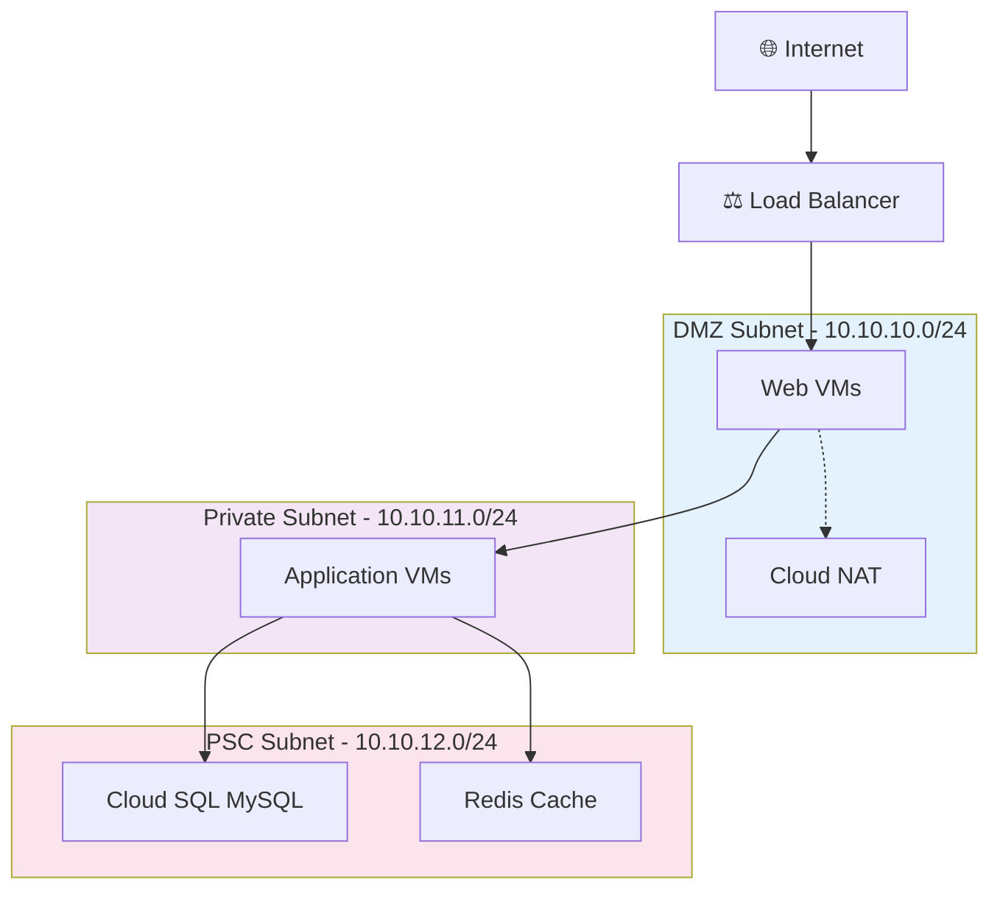
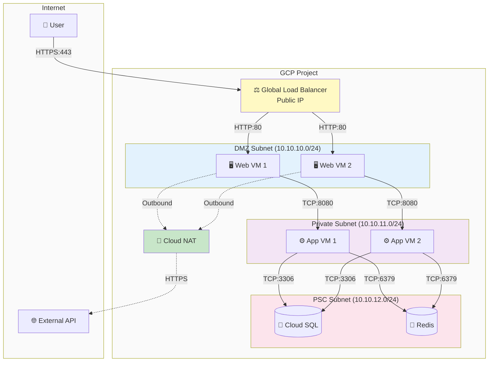
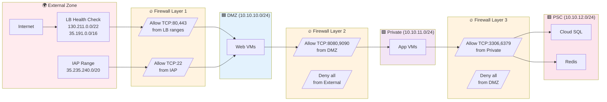
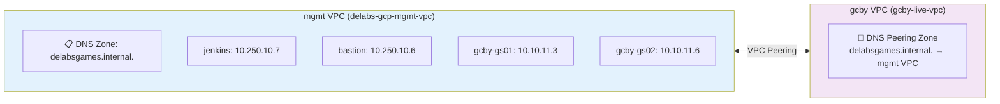
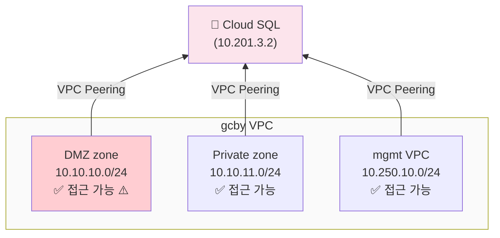
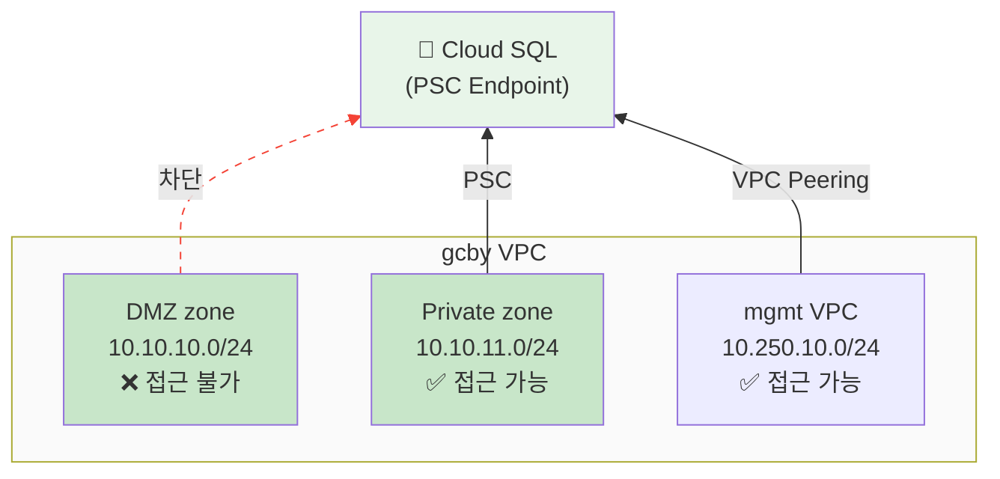
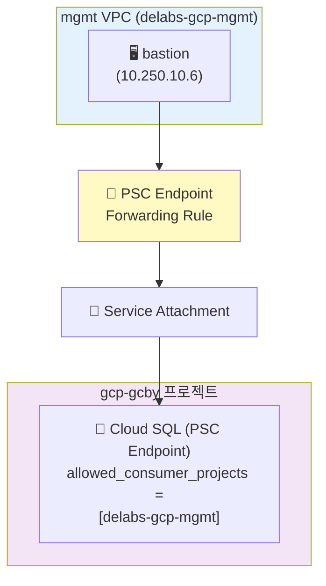
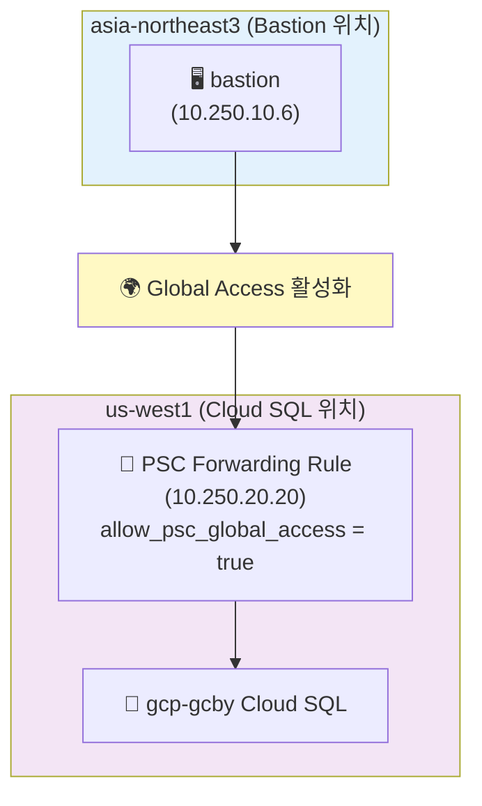
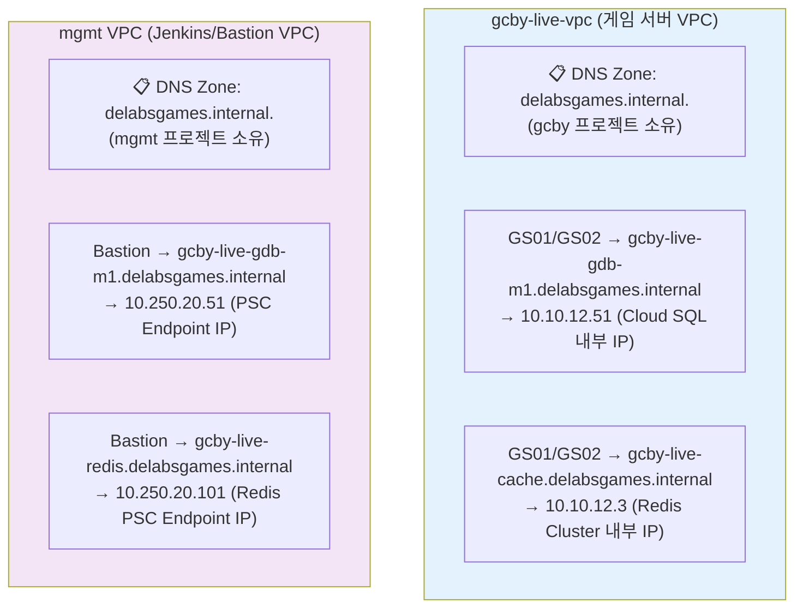

# 네트워크 설계

GCP VPC 네트워크의 DMZ/Private/DB 3-Tier 아키텍처 설계입니다.

## 아키텍처 개요



## 서브넷 설계

### 1. DMZ Subnet (Public Tier)

**목적**: 외부 트래픽 처리

**특징**:

- CIDR: `10.10.10.0/24`
- VM: Public IP 없음 (LB 경유)
- Outbound: Cloud NAT 사용
- 용도: Web 서버, API Gateway

**보안**:

- LB에서만 Inbound 허용
- Cloud NAT로 Outbound 제한
- 방화벽 규칙으로 포트 제한

### 2. Private Subnet (Application Tier)

**목적**: 내부 비즈니스 로직 처리

**특징**:

- CIDR: `10.10.11.0/24`
- VM: Public IP 없음
- Outbound: Cloud NAT 사용
- 용도: App 서버, Worker

**보안**:

- DMZ에서만 접근 가능
- 외부 노출 없음
- Internal Load Balancer 사용

### 3. PSC Subnet (Data Tier)

**목적**: 데이터 저장 및 관리 (PSC Endpoint)

**특징**:

- CIDR: `10.10.12.0/24`
- Cloud SQL: PSC Endpoint (10.10.12.51)
- Redis Cache: PSC Endpoint (10.10.12.3, 10.10.12.2)
- 용도: MySQL, Redis

**보안**:

- Private에서만 접근 가능
- 외부 IP 없음
- PSC로 완전 격리

## Private Service Connect

### 설정 예시

```hcl
# 10-network/main.tf
resource "google_compute_global_address" "private_ip_alloc" {
  name          = "private-ip-alloc"
  purpose       = "VPC_PEERING"
  address_type  = "INTERNAL"
  prefix_length = 16
  network       = google_compute_network.vpc.id
}

resource "google_service_networking_connection" "private_vpc_connection" {
  network = google_compute_network.vpc.id
  service = "servicenetworking.googleapis.com"
  reserved_peering_ranges = [
    google_compute_global_address.private_ip_alloc.name
  ]
}
```

### 효과

- Cloud SQL이 VPC 내부 IP 사용
- 외부 노출 없음
- 서브넷 간 Private IP 통신

## Cloud NAT (DMZ 전용)

### 설정 절차

```hcl
resource "google_compute_router_nat" "nat" {
  name   = "nat-gateway"
  router = google_compute_router.router.name
  region = var.region_primary

  nat_ip_allocate_option = "AUTO_ONLY"
  source_subnetwork_ip_ranges_to_nat = "LIST_OF_SUBNETWORKS"

  subnetwork {
    name                    = google_compute_subnetwork.dmz.id
    source_ip_ranges_to_nat = ["ALL_IP_RANGES"]
  }
}
```

### 특징

- DMZ 서브넷만 NAT 적용
- Private/DB 서브넷은 NAT 없음
- Outbound 트래픽만 허용

## 방화벽 규칙

### DMZ 규칙

```hcl
# LB → DMZ (HTTP/HTTPS)
ingress {
  source_ranges = ["130.211.0.0/22", "35.191.0.0/16"]  # LB
  protocol      = "tcp"
  ports         = ["80", "443"]
}

# IAP → DMZ (SSH)
ingress {
  source_ranges = ["35.235.240.0/20"]
  protocol      = "tcp"
  ports         = ["22"]
}
```

### Private 규칙

```hcl
# DMZ → Private (App)
ingress {
  source_ranges = ["10.10.10.0/24"]  # DMZ
  protocol      = "tcp"
  ports         = ["8080", "9090"]
}
```

### PSC 규칙

```hcl
# Private → PSC (MySQL, Redis)
ingress {
  source_ranges = ["10.10.11.0/24"]  # Private only
  protocol      = "tcp"
  ports         = ["3306", "6379"]
}
```

## 트래픽 흐름

### 데이터 흐름도 (Mermaid)



### 보안 경계 다이어그램 (Firewall Rules)



### 외부 → 내부 (Ingress)

```text
User → Internet → LB (Public IP)
  → DMZ (10.10.10.x) → Private (10.10.11.x)
  → PSC (10.10.12.x)
```

### 내부 → 외부 (Egress)

```text
DMZ (10.10.10.x) → Cloud NAT → Internet
Private (10.10.11.x) → Cloud NAT → Internet
PSC → ❌ (Outbound 없음)
```

### 내부 통신

```text
DMZ ↔ Private: 직접 통신 (10.10.x.0/24)
Private → PSC: 직접 통신 (PSC Endpoint)
DMZ → PSC: 차단 (네트워크 레벨 격리)
```

## VPC Flow Logs

### 활성화

```hcl
resource "google_compute_subnetwork" "dmz" {
  # ...
  log_config {
    aggregation_interval = "INTERVAL_5_SEC"
    flow_sampling        = 0.5
    metadata             = "INCLUDE_ALL_METADATA"
  }
}
```

### 확인

```bash
gcloud logging read \
    "resource.type=gce_subnetwork" \
    --project=gcp-gcby \
    --limit=50
```

## IP 주소 계획

### CIDR 할당

```text
VPC:     10.10.0.0/16     (65,536 IPs)
├─ DMZ:      10.10.10.0/24  (256 IPs)
├─ Private:  10.10.11.0/24  (256 IPs)
├─ PSC:      10.10.12.0/24  (256 IPs)
└─ Reserved: 10.10.13.0/22  (1,024 IPs, 확장용)
```

### IP 사용량

- **DMZ**: 10-50 VMs (80% 여유)
- **Private**: 20-100 VMs (60% 여유)
- **PSC**: 5-20 endpoints (90% 여유)

## 고가용성 (HA)

### Multi-Zone 배포

```hcl
# VM을 여러 Zone에 분산
zones = [
  "us-west1-a",
  "us-west1-b",
  "us-west1-c"
]
```

### Load Balancer

- Health Check로 장애 감지
- 자동 Failover
- Cross-region 지원 (선택)

### Cloud SQL

- Regional HA (Multi-AZ)
- 자동 Failover
- Read Replica (선택)

## 확장 전략

### 수평 확장 (Scale Out)

```text
1. Instance Group 크기 조정
2. Auto-scaling 정책 추가
3. LB Backend 자동 등록
```

### 수직 확장 (Scale Up)

```text
1. VM Machine Type 변경
2. DB Tier 업그레이드
3. Redis 메모리 증설
```

### 네트워크 확장

```text
1. 새 서브넷 추가 (10.0.4.0/24)
2. VPC Peering (다른 VPC)
3. Cloud VPN/Interconnect (On-premise)
```

## 보안 체크리스트

- [ ] DMZ만 Cloud NAT 사용
- [ ] Private/DB는 Public IP 없음
- [ ] PSC로 DB 격리
- [ ] 방화벽 규칙 최소 권한
- [ ] VPC Flow Logs 활성화
- [ ] IAP로 SSH 접근
- [ ] LB에 Cloud Armor 적용 (DDoS)
- [ ] SSL/TLS 인증서 적용

## DNS Peering (Cross-VPC DNS 해석)

### 개요

여러 VPC 간 DNS 이름 해석을 공유하여 중앙 집중식 DNS 관리를 구현합니다.

### 아키텍처



### 구성 요소

#### 1. VPC Peering (양방향)

**mgmt → gcby:**
```hcl
resource "google_compute_network_peering" "mgmt_to_gcby" {
  name         = "peering-mgmt-to-gcby"
  network      = google_compute_network.mgmt_vpc.self_link
  peer_network = "projects/gcp-gcby/global/networks/gcby-live-vpc"

  import_custom_routes = true
  export_custom_routes = true
}
```

**gcby → mgmt:**
```hcl
resource "google_compute_network_peering" "gcby_to_mgmt" {
  name         = "peering-gcby-to-mgmt"
  network      = module.net.vpc_self_link
  peer_network = "projects/delabs-gcp-mgmt/global/networks/delabs-gcp-mgmt-vpc"

  import_custom_routes = true
  export_custom_routes = true
}
```

#### 2. 중앙 DNS Zone (mgmt VPC)

**파일:** `bootstrap/12-dns/layer.hcl`

```hcl
dns_zone_name = "delabsgames-internal"
dns_name      = "delabsgames.internal."
visibility    = "private"

dns_records = {
  # mgmt 프로젝트 VM들
  "jenkins" = {
    type    = "A"
    ttl     = 300
    rrdatas = ["10.250.10.7"]
  }
  "bastion" = {
    type    = "A"
    ttl     = 300
    rrdatas = ["10.250.10.6"]
  }

  # gcp-gcby 프로젝트 VM들
  "gcby-gs01" = {
    type    = "A"
    ttl     = 300
    rrdatas = ["10.10.11.3"]
  }
  "gcby-gs02" = {
    type    = "A"
    ttl     = 300
    rrdatas = ["10.10.11.6"]
  }
}
```

#### 3. DNS Peering Zone (각 프로젝트 VPC)

**파일:** `environments/LIVE/gcp-gcby/12-dns/terraform.tfvars`

```hcl
zone_name   = "gcby-dns-peering-to-mgmt"
dns_name    = "delabsgames.internal."
description = "DNS Peering to mgmt VPC for internal name resolution"
visibility  = "private"

# DNS Peering 설정 (mgmt VPC의 DNS Zone 참조)
peering_network = "projects/delabs-gcp-mgmt/global/networks/delabs-gcp-mgmt-vpc"

# DNS 레코드는 mgmt에서만 관리
dns_records = []
```

### 장점

- **중앙 관리:** 모든 DNS 레코드를 mgmt VPC에서 관리
- **일관성:** 단일 진실 공급원 (Single Source of Truth)
- **확장성:** 새 프로젝트 추가 시 DNS Peering Zone만 생성
- **단방향 제어:** mgmt에서만 DNS 레코드 수정 가능

### 사용 예시

```bash
# jenkins VM에서 gcby VM 접근
ssh gcby-gs01.delabsgames.internal  # 10.10.11.3으로 해석
ssh gcby-gs02.delabsgames.internal  # 10.10.11.6으로 해석

# bastion VM에서 Cloud SQL 접근
mysql -h gcby-db-master.delabsgames.internal -u root -p
```

---

## Cloud SQL Private Service Connect (PSC Endpoint)

### 개요

PSC Endpoint 방식은 Cloud SQL을 특정 subnet에만 노출하여 3-tier 네트워크 격리를 구현합니다.

### VPC Peering vs PSC Endpoint 비교

| 구성 요소 | VPC Peering 방식 | PSC Endpoint 방식 |
|---------|----------------|------------------|
| **연결 방식** | `google_service_networking_connection` | `google_network_connectivity_service_connection_policy` |
| **격리 수준** | 전체 VPC | **특정 Subnet만** |
| **IP 대역** | GCP 자동 할당 (예: 10.201.3.0/24) | 사용자 지정 가능 |
| **DMZ 접근** | ✅ 가능 (보안 취약) | ❌ 불가능 (3-tier 준수) |
| **Private 접근** | ✅ 가능 | ✅ 가능 |
| **다중 VPC 지원** | 제한적 | ✅ 우수 |

### 아키텍처 변화

#### Before (VPC Peering 방식)



#### After (PSC Endpoint 방식)



### Service Connection Policy 구성

**파일:** `environments/LIVE/gcp-gcby/10-network/main.tf`

```hcl
resource "google_network_connectivity_service_connection_policy" "cloudsql_psc" {
  count         = var.enable_cloudsql_psc_policy ? 1 : 0
  project       = var.project_id
  location      = local.cloudsql_psc_region
  name          = local.cloudsql_psc_policy_name
  service_class = "google-cloud-sql"  # 올바른 service class 이름
  network       = "projects/${var.project_id}/global/networks/${module.naming.vpc_name}"

  psc_config {
    subnetworks = [local.cloudsql_psc_subnet_self_link]  # Private subnet만!
    limit       = var.cloudsql_psc_connection_limit       # Master + Replicas
  }

  depends_on = [
    module.net,
    time_sleep.wait_networkconnectivity_api
  ]
}
```

**파일:** `environments/LIVE/gcp-gcby/10-network/terraform.tfvars`

```hcl
# VPC Peering 방식 비활성화
enable_private_service_connection = false

# Cloud SQL PSC Endpoint 활성화
enable_cloudsql_psc_policy = true
cloudsql_psc_connection_limit = 5  # Master + Read Replicas
```

### Cloud SQL 설정

**파일:** `environments/LIVE/gcp-gcby/60-database/terraform.tfvars`

```hcl
# Network configuration
ipv4_enabled = false  # No Public IP
enable_psc   = true   # PSC Endpoint (Private subnet only access)
```

**파일:** `modules/cloudsql-mysql/main.tf`

```hcl
settings {
  ip_configuration {
    ipv4_enabled = var.ipv4_enabled

    # PSC 방식: psc_enabled = true, private_network = null
    # VPC Peering 방식: private_network 사용
    private_network = var.enable_psc ? null : (
      length(trimspace(var.private_network)) > 0 ? var.private_network : null
    )

    # PSC Endpoint 활성화
    psc_enabled = var.enable_psc
  }
}
```

### 보안 효과

#### 3-tier 격리 완성

**DMZ zone (10.10.10.0/24):**
- 외부 노출 가능 영역
- Cloud SQL 접근 불가 (네트워크 레벨 격리)
- 방화벽 우회 불가능 (Endpoint가 subnet에 생성되지 않음)

**Private zone (10.10.11.0/24):**
- 백엔드 애플리케이션 영역
- Cloud SQL 접근 가능 (PSC Endpoint 통해)
- 비즈니스 로직 처리

**DB layer:**
- Private subnet에서만 접근
- DMZ → DB 직접 접근 차단
- 데이터 보호 강화

#### 네트워크 격리 방식 비교

**방화벽 규칙 (EGRESS):**
- 설정: 방화벽 규칙으로 DMZ → DB 차단
- 한계: 방화벽 규칙 수정 시 우회 가능
- 복잡도: 지속적인 규칙 관리 필요

**PSC Endpoint:**
- 설정: Service Connection Policy로 subnet 지정
- 장점: 네트워크 레벨 격리 (우회 불가능)
- 복잡도: 초기 설정 후 관리 불필요

### 마이그레이션 절차

#### 1. 백업 확인
```bash
gcloud sql backups list \
  --instance=gcby-live-gdb-m1 \
  --project=gcp-gcby
```

#### 2. 10-network 재구성
- Jenkins Job: `(LIVE) gcp-gcby`
- Target Layer: `10-network`
- Action: `apply`
- 변경: Cloud SQL Service Connection Policy 생성

#### 3. 기존 Cloud SQL 삭제
- Jenkins Job: `(LIVE) gcp-gcby`
- Target Layer: `60-database`
- Action: `destroy`

#### 4. 새 Cloud SQL 생성
- Jenkins Job: `(LIVE) gcp-gcby`
- Target Layer: `60-database`
- Action: `apply`
- 결과: PSC Endpoint 방식으로 생성됨

#### 5. 검증
```bash
# Private zone VM에서 접근 (성공)
gcloud compute ssh gcby-gs01 --project=gcp-gcby
mysql -h <PSC_ENDPOINT_IP> -u root -p

# DMZ zone VM에서 접근 (실패 - 네트워크 격리)
# 연결 타임아웃 발생
```

### 주의사항

⚠️ **Cloud SQL 재생성 필요:**
- VPC Peering → PSC Endpoint 전환 시 다운타임 발생
- 사전에 백업 확인 필수
- Read Replica는 Master와 동일한 네트워크 방식 사용

⚠️ **API 활성화:**
- `networkconnectivity.googleapis.com` 필수
- 10-network에서 자동 활성화 및 대기 시간 확보

---

## Private Service Connection IP 대역 사용자 지정

### 개요

VPC Peering 방식의 Private Service Connection은 IP 대역을 명시적으로 지정할 수 있습니다.

### 기본 vs 사용자 지정

| 방식 | IP 대역 | 관리 |
|------|--------|------|
| **자동 할당** | 10.201.x.0/24 (GCP 자동) | GCP 관리 |
| **사용자 지정** | 10.10.12.0/24 (명시) | 사용자 관리 |

### 설정 방법

**파일:** `environments/LIVE/gcp-gcby/10-network/terraform.tfvars`

```hcl
# Private Service Connection (VPC Peering 방식)
# Cloud SQL 등의 관리형 서비스가 사용할 IP 대역
enable_private_service_connection = true
private_service_connection_address = "10.10.12.0"
private_service_connection_prefix_length = 24
```

**파일:** `modules/network-dedicated-vpc/main.tf`

```hcl
resource "google_compute_global_address" "private_service_connect" {
  count        = var.enable_private_service_connection ? 1 : 0
  name         = local.private_service_connection_name
  project      = var.project_id
  purpose      = "VPC_PEERING"
  address_type = "INTERNAL"

  address       = var.private_service_connection_address  # 명시적 지정
  prefix_length = var.private_service_connection_prefix_length
  network       = google_compute_network.vpc.id
}
```

### 장점

- **일관성**: 프로젝트 간 통일된 IP 체계
- **예측 가능**: 미리 할당된 IP 대역 사용
- **관리 편의**: IP 충돌 방지 및 문서화 용이

---

## Cross-Project PSC 접근 (mgmt → gcp-gcby)

### 개요

mgmt VPC의 bastion 호스트에서 다른 프로젝트의 Cloud SQL에 PSC를 통해 접근합니다.

### 아키텍처



### 1. Cloud SQL 설정 (gcp-gcby)

**파일:** `environments/LIVE/gcp-gcby/60-database/terraform.tfvars`

```hcl
enable_psc = true
psc_allowed_consumer_projects = [
  "gcp-gcby",         # 자기 프로젝트
  "delabs-gcp-mgmt"   # mgmt 프로젝트 (bastion 접근용)
]
```

**파일:** `modules/cloudsql-mysql/main.tf`

```hcl
ip_configuration {
  dynamic "psc_config" {
    for_each = var.enable_psc ? [1] : []
    content {
      psc_enabled               = true
      allowed_consumer_projects = var.psc_allowed_consumer_projects
    }
  }
}
```

### 2. PSC 리전 제약사항

⚠️ **중요: PSC Endpoint는 Service Attachment와 동일 리전에 있어야 합니다.**

```text
❌ 지원 안 됨:
Cloud SQL (us-west1) ←→ PSC Endpoint (asia-northeast3)

✅ 지원됨:
Cloud SQL (us-west1) ←→ PSC Endpoint (us-west1)
```

**해결 방법:**
- mgmt VPC에 Cloud SQL과 동일한 리전의 서브넷 생성
- PSC Endpoint는 해당 서브넷에 생성

### 3. mgmt VPC 멀티리전 서브넷 구성

**파일:** `bootstrap/10-network/layer.hcl`

```hcl
locals {
  # Primary Subnet (asia-northeast3)
  subnet_cidr = "10.250.10.0/24"

  # us-west1 Subnet (PSC Endpoint용)
  subnet_cidr_us_west1 = "10.250.20.0/24"
}
```

**파일:** `bootstrap/10-network/main.tf`

```hcl
# Primary subnet (asia-northeast3)
resource "google_compute_subnetwork" "mgmt_subnet" {
  name          = "${var.management_project_id}-subnet"
  ip_cidr_range = var.subnet_cidr
  region        = var.region_primary  # asia-northeast3
  network       = google_compute_network.mgmt_vpc.id
}

# us-west1 subnet (PSC Endpoint용)
resource "google_compute_subnetwork" "mgmt_subnet_us_west1" {
  name          = "${var.management_project_id}-subnet-us-west1"
  ip_cidr_range = var.subnet_cidr_us_west1
  region        = "us-west1"
  network       = google_compute_network.mgmt_vpc.id
}

# 각 리전별 Router 및 NAT 필요
resource "google_compute_router" "mgmt_router_us_west1" {
  name    = "${var.management_project_id}-router-us-west1"
  region  = "us-west1"
  network = google_compute_network.mgmt_vpc.id
}

resource "google_compute_router_nat" "mgmt_nat_us_west1" {
  name   = "${var.management_project_id}-nat-us-west1"
  router = google_compute_router.mgmt_router_us_west1.name
  region = "us-west1"

  nat_ip_allocate_option             = "AUTO_ONLY"
  source_subnetwork_ip_ranges_to_nat = "ALL_SUBNETWORKS_ALL_IP_RANGES"
}
```

### 4. mgmt VPC PSC Endpoint 설정

**파일:** `bootstrap/12-dns/main.tf`

```hcl
# PSC Endpoint IP 예약
resource "google_compute_address" "psc_endpoints" {
  for_each = var.psc_endpoints

  project      = var.management_project_id
  name         = each.value.name
  address_type = "INTERNAL"
  purpose      = "GCE_ENDPOINT"
  region       = each.value.region
  subnetwork   = each.value.subnetwork
  address      = try(each.value.ip_address, null)
}

# PSC Forwarding Rule (Service Attachment 연결)
resource "google_compute_forwarding_rule" "psc_endpoints" {
  for_each = var.psc_endpoints

  project               = var.management_project_id
  name                  = "${each.value.name}-fr"
  region                = each.value.region
  network               = var.vpc_self_link
  ip_address            = google_compute_address.psc_endpoints[each.key].id
  load_balancing_scheme = ""
  target                = each.value.service_attachment
}

# DNS 레코드 자동 생성
resource "google_dns_record_set" "psc_endpoint_records" {
  for_each = var.psc_endpoints

  project      = var.management_project_id
  managed_zone = google_dns_managed_zone.private.name
  name         = "${each.value.dns_name}.${var.dns_domain}"
  type         = "A"
  ttl          = 300
  rrdatas      = [google_compute_address.psc_endpoints[each.key].address]
}
```

**파일:** `bootstrap/12-dns/layer.hcl`

```hcl
psc_endpoints = {
  "gcby-cloudsql" = {
    name               = "gcby-cloudsql-psc"
    region             = "us-west1"  # Cloud SQL과 동일 리전
    subnetwork         = "projects/delabs-gcp-mgmt/regions/us-west1/subnetworks/delabs-gcp-mgmt-subnet-us-west1"  # us-west1 서브넷 사용
    service_attachment = "projects/va89486946f7d978dp-tp/regions/us-west1/serviceAttachments/a-be04a6986d44-psc-service-attachment-a54302c8eccd8399"
    dns_name           = "gcby-live-gdb-m1"  # 인스턴스 이름과 일치
    ip_address         = "10.250.20.20"  # us-west1 서브넷 대역 내 IP
  }
}
```

### 5. Service Attachment URI 확인

Cloud SQL 생성 후:

```bash
gcloud sql instances describe gcby-live-gdb-m1 \
  --project=gcp-gcby \
  --format="value(pscServiceAttachmentLink)"
```

### 6. Bastion 접속 테스트

```bash
# Bastion에 SSH 접속
gcloud compute ssh bastion --project=delabs-gcp-mgmt

# DNS 해석 확인
nslookup gcby-live-gdb-m1.delabsgames.internal
# 예상 결과: 10.250.20.20

# 네트워크 연결 테스트
nc -zv gcby-live-gdb-m1.delabsgames.internal 3306

# MySQL 접속 (사용자 계정 생성 후)
mysql -h gcby-live-gdb-m1.delabsgames.internal -u user -p
```

### 보안 효과

- **프로젝트 격리**: mgmt 프로젝트는 allowed list에 명시적으로 추가된 경우만 접근 가능
- **네트워크 격리**: PSC Endpoint를 통한 제어된 접근
- **중앙 관리**: mgmt VPC에서 모든 프로젝트 DB 관리

---

## PSC Global Access (Cross-Region 접근)

### 개요

PSC Endpoint는 Service Attachment와 동일 리전에 있어야 하지만, **Global Access**를 활성화하면 다른 리전에서도 접근할 수 있습니다.

### 아키텍처



### 설정 방법

**파일:** `bootstrap/10-network/layer.hcl`

```hcl
psc_endpoints = {
  gcby-cloudsql = {
    region                    = "us-west1"
    ip_address                = "10.250.20.20"
    target_service_attachment = "projects/.../serviceAttachments/..."
    allow_global_access       = true  # Cross-region 활성화 ✅
  }
}
```

**파일:** `bootstrap/10-network/main.tf`

```hcl
# IP 주소 예약
resource "google_compute_address" "psc_addresses" {
  for_each = var.psc_endpoints

  name         = "${each.key}-psc-ip"
  region       = each.value.region
  subnetwork   = each.value.region == "us-west1" ? google_compute_subnetwork.mgmt_subnet_us_west1.id : google_compute_subnetwork.mgmt_subnet.id
  address_type = "INTERNAL"
  address      = each.value.ip_address
  purpose      = "GCE_ENDPOINT"
}

# PSC Forwarding Rule
resource "google_compute_forwarding_rule" "psc_endpoints" {
  for_each = var.psc_endpoints

  name                    = "${each.key}-psc-fr"
  region                  = each.value.region
  network                 = google_compute_network.mgmt_vpc.id
  ip_address              = google_compute_address.psc_addresses[each.key].id
  load_balancing_scheme   = ""
  target                  = each.value.target_service_attachment
  allow_psc_global_access = each.value.allow_global_access  # ✅
}
```

### 주요 포인트

1. **PSC Endpoint 위치**: Service Attachment와 동일 리전 (us-west1)
2. **Global Access**: Forwarding Rule에 `allow_psc_global_access = true` 설정
3. **접근 가능**: 모든 리전의 VM에서 PSC Endpoint IP로 접근 가능
4. **IP 주소 예약**: `google_compute_address` 리소스로 먼저 예약 (`purpose = "GCE_ENDPOINT"`)
5. **Forwarding Rule**: 예약된 IP 주소 참조 (문자열 직접 지정 불가)

### 검증

```bash
# Global Access 확인
gcloud compute forwarding-rules describe gcby-cloudsql-psc-fr \
  --region=us-west1 \
  --project=delabs-gcp-mgmt \
  --format="value(allowPscGlobalAccess)"
# 예상 결과: True

# Bastion (asia-northeast3)에서 Cloud SQL (us-west1) 접속 테스트
gcloud compute ssh delabs-bastion --project=delabs-gcp-mgmt
nc -zv gcby-live-gdb-m1.delabsgames.internal 3306
# 예상 결과: Connection succeeded
```

### 제약사항

- **리전 제약**: Service Attachment는 특정 리전에 고정
- **Global Access 필수**: Cross-region 접근을 위해서는 활성화 필요
- **IP 예약 필수**: Forwarding Rule 생성 전 `google_compute_address` 리소스 생성
- **리소스 참조**: IP 주소는 문자열이 아닌 리소스 ID로 참조

### GCP 공식 문서

> "By using the optional `--allow-psc-global-access` parameter, clients from all regions can access this forwarding rule."

**참고**: https://cloud.google.com/sql/docs/mysql/configure-private-service-connect

---

## Per-VPC Private DNS Zone 패턴

### 개요

동일한 DNS 도메인(`delabsgames.internal.`)에 대해 VPC별로 다른 IP를 반환하여, 각 네트워크 환경에 맞는 접근 경로를 제공합니다.

### 아키텍처



### 장점

| 장점 | 설명 |
|------|------|
| **네트워크 최적화** | 각 VPC에서 최적 경로로 접근 |
| **보안** | PSC Endpoint로 제어된 cross-project 접근 |
| **유연성** | 프로젝트별 독립적인 DNS 관리 |
| **확장성** | 새 프로젝트 추가 시 기존 구조 영향 없음 |

### has_own_dns_zone 플래그 패턴

자체 DNS Zone이 있는 프로젝트를 mgmt DNS Zone에서 자동으로 제외합니다.

**파일:** `bootstrap/common.hcl`

```hcl
projects = {
  gcby = {
    project_id       = "gcp-gcby"
    vpc_name         = "gcby-live-vpc"
    network_url      = "projects/gcp-gcby/global/networks/gcby-live-vpc"
    has_own_dns_zone = true  # 자체 DNS Zone 있음 - mgmt DNS Zone에서 제외
    # ...
  }

  # 자체 DNS Zone이 없는 프로젝트 예시
  # abc = {
  #   project_id       = "gcp-abc"
  #   network_url      = "projects/gcp-abc/global/networks/abc-live-vpc"
  #   # has_own_dns_zone 생략 → mgmt DNS Zone에 추가됨
  # }
}
```

**파일:** `bootstrap/12-dns/terragrunt.hcl`

```hcl
inputs = merge(
  local.common_vars.locals,
  local.layer_vars.locals,
  {
    # 자체 DNS Zone이 없는 프로젝트만 mgmt DNS Zone에 추가
    additional_networks = [
      for key, project in local.common_vars.locals.projects : project.network_url
      if try(project.has_own_dns_zone, false) == false
    ]
  }
)
```

### 새 프로젝트 추가 가이드

| 케이스 | has_own_dns_zone | 결과 |
|--------|------------------|------|
| **자체 DNS Zone 있음** | `true` | mgmt DNS Zone에서 제외 (충돌 방지) |
| **자체 DNS Zone 없음** | 생략 또는 `false` | mgmt DNS Zone의 additional_networks에 추가 |

### 주의사항

⚠️ **DNS Zone 이름 충돌:**
- 같은 VPC에 동일한 DNS 이름의 Zone을 중복 연결할 수 없음
- `has_own_dns_zone = true` 설정으로 충돌 방지

⚠️ **DNS 레코드 관리:**
- 자체 DNS Zone이 있는 프로젝트는 해당 프로젝트에서 레코드 관리
- mgmt DNS Zone의 레코드와 동기화 불필요 (동일 DNS 이름, 다른 IP)

### 관련 문서

- [Work History 2025-12-04](../changelog/work_history/2025-12-04.md#session-3-cross-project-psc-redis-연결-및-dns-zone-충돌-해결) - DNS Zone 충돌 해결

---

## 참고 자료

- [전체 아키텍처](./overview.md)
- [network-dedicated-vpc 모듈](../modules/network-dedicated-vpc.md)
- [네트워크 문제 해결](../troubleshooting/network-issues.md)
- [Work History 2025-12-01](../changelog/work_history/2025-12-01.md) - DNS Peering 및 PSC Endpoint 전환
- [Work History 2025-12-04](../changelog/work_history/2025-12-04.md) - Per-VPC DNS Zone 패턴
