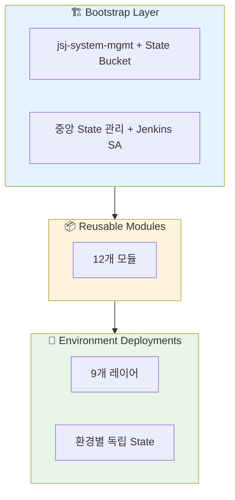
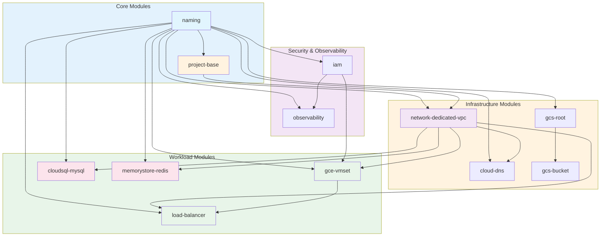
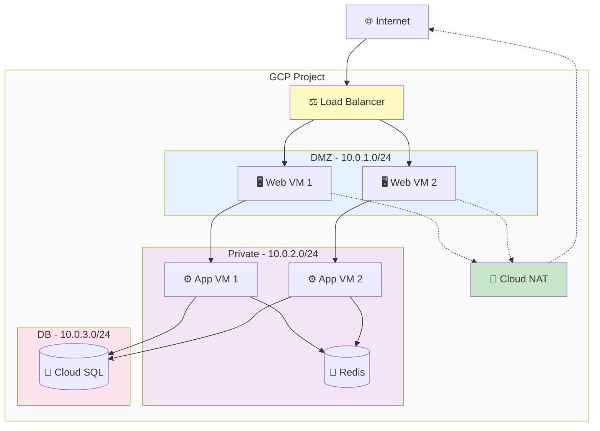
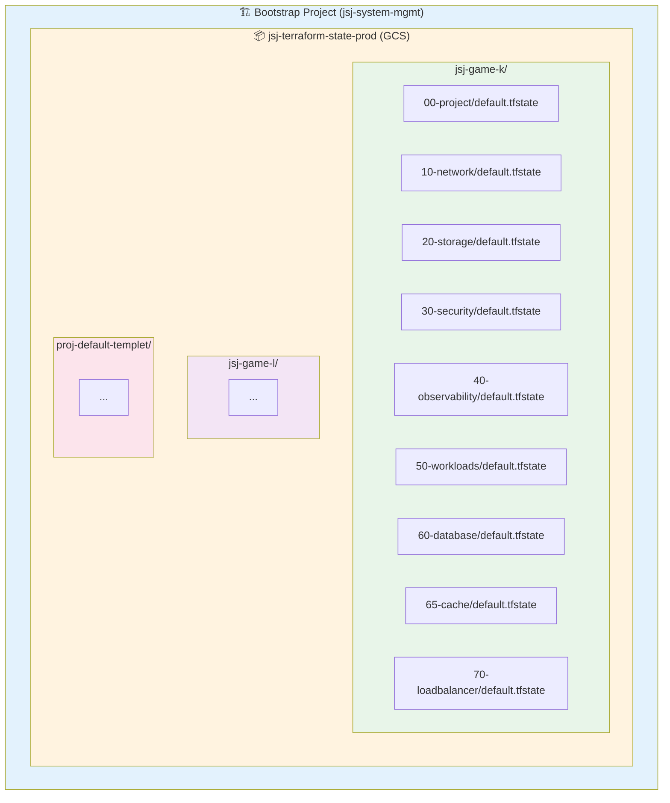

# 아키텍처 개요

이 문서는 Terraform GCP 인프라의 전체 구조와 설계 원칙을 설명합니다.

## 시스템 구성



## 3-Tier 구조

### 1. Bootstrap Layer (관리 계층)

**목적**: 중앙 집중식 인프라 관리

**구성 요소**:

- `jsj-system-mgmt` 프로젝트
- `jsj-terraform-state-prod` GCS 버킷
- `jenkins-terraform-admin` Service Account
- 조직/폴더 구조 (optional)

**특징**:

- ✅ 로컬 State 사용 (의도적 설계)
- ✅ 삭제 방지 (deletion_policy = PREVENT)
- ✅ 모든 프로젝트의 State 중앙 관리

### 2. Module Layer (재사용 계층)

**목적**: 재사용 가능한 인프라 컴포넌트

#### 모듈 관계도



**모듈 목록**:

| 모듈 | 주요 기능 | 카테고리 |
|------|----------|---------|
| **naming** | 중앙 집중식 네이밍 규칙 | 공통 |
| **project-base** | GCP 프로젝트 생성 및 API 활성화 | 프로젝트 |
| **network-dedicated-vpc** | VPC, 서브넷, 방화벽, NAT | 네트워킹 |
| **gcs-root** | 다중 버킷 관리 | 스토리지 |
| **gcs-bucket** | 단일 버킷 상세 설정 | 스토리지 |
| **iam** | IAM 바인딩 및 SA 관리 | 보안 |
| **observability** | Logging 싱크, Alert 정책 | 관찰성 |
| **gce-vmset** | VM 인스턴스, Instance Group | 컴퓨팅 |
| **cloudsql-mysql** | MySQL 데이터베이스 | 데이터베이스 |
| **memorystore-redis** | Redis 캐시 | 캐시 |
| **load-balancer** | HTTP(S)/Internal LB | 로드밸런싱 |

**설계 원칙**:

- ✅ Provider 블록 없음 (재사용성 향상)
- ✅ Optional 변수 지원 (Terraform 1.6+)
- ✅ 완전한 입력 검증
- ✅ 포괄적인 Output

### 3. Environment Layer (배포 계층)

**목적**: 실제 워크로드 배포

**레이어 구조**:

```text
environments/LIVE/jsj-game-k/
├── common.naming.tfvars    # 공통 네이밍 변수
├── root.hcl                # Terragrunt 루트 설정
├── Jenkinsfile             # CI/CD Pipeline
├── 00-project/             # 프로젝트 생성
├── 10-network/             # 네트워크 구성
├── 20-storage/             # GCS 버킷
├── 30-security/            # IAM 및 SA
├── 40-observability/       # Logging/Monitoring
├── 50-workloads/           # VM 인스턴스
├── 60-database/            # Cloud SQL
├── 65-cache/               # Redis
└── 70-loadbalancer/        # Load Balancer
```

**배포 순서**:

1. **00-project** - 프로젝트 생성, API 활성화
2. **10-network** - VPC, 서브넷, 방화벽, PSC
3. **20-storage, 30-security, 40-observability** - 병렬 배포 가능
4. **50-workloads** - VM 인스턴스
5. **60-database** - Cloud SQL (Private IP)
6. **65-cache** - Redis (Private IP)
7. **70-loadbalancer** - LB 설정

## 네트워크 아키텍처

### DMZ / Private / DB 서브넷 구조



**보안 계층**:

- **DMZ**: 외부 접근 가능 (LB 경유), NAT로 Outbound만 허용
- **Private**: 내부 통신만 (No public IP)
- **DB**: 완전 격리 (Private IP only, PSC 연결)

## 네이밍 규칙

### modules/naming을 통한 중앙 집중식 관리

모든 리소스 이름과 라벨은 `modules/naming` 모듈에서 일관되게 생성됩니다.

**입력** (`common.naming.tfvars`):

```hcl
project_id     = "jsj-game-k"
project_name   = "game-k"
environment    = "prod"
organization   = "delabs"
region_primary = "asia-northeast3"
region_backup  = "asia-northeast1"
```

**출력** (자동 생성):

```hcl
vpc_name                = "delabs-prod-game-k-vpc"
bucket_name_prefix      = "delabs-prod-game-k"
db_instance_name        = "delabs-prod-game-k-mysql"
redis_instance_name     = "delabs-prod-game-k-redis"
sa_name_prefix          = "delabs-prod-game-k"
forwarding_rule_name    = "delabs-prod-game-k-lb"

common_labels = {
  environment   = "prod"
  managed-by    = "terraform"
  project       = "game-k"
  organization  = "delabs"
}
```

**장점**:

- ✅ 전체 인프라에서 일관된 네이밍
- ✅ `common.naming.tfvars` 한 곳만 수정
- ✅ 자동 라벨 적용으로 비용 추적 용이

## State 관리 전략

### 중앙 집중식 + 레이어별 분리



**특징**:

- ✅ 중앙 버킷에 모든 State 저장
- ✅ 프로젝트별 prefix로 격리
- ✅ 레이어별 독립 State (빠른 Plan/Apply)
- ✅ Versioning (최근 10개 보관)
- ✅ Lifecycle 정책 (30일 후 자동 삭제)

### Terragrunt 자동화

**root.hcl** (환경 루트):

```hcl
remote_state {
  backend = "gcs"
  generate = {
    path      = "backend.tf"
    if_exists = "overwrite_terragrunt"
  }
  config = {
    project  = "jsj-system-mgmt"
    location = "asia"
    bucket   = "jsj-terraform-state-prod"
    prefix   = "jsj-game-k/${path_relative_to_include()}"
  }
}
```

**결과**:

- Terragrunt가 각 레이어에 `backend.tf` 자동 생성
- Terraform 코드에 backend 블록 불필요
- State 경로 수동 관리 불필요

## 보안 설계

### 다층 보안 (Defense in Depth)

1. **네트워크 계층**
   - DMZ/Private/DB 서브넷 분리
   - 방화벽 규칙 (최소 권한)
   - Private Service Connect (DB 격리)
   - Cloud NAT (Outbound only)

2. **IAM 계층**
   - Non-authoritative 바인딩 (충돌 방지)
   - 역할별 Service Account
   - 최소 권한 원칙

3. **데이터 계층**
   - Private IP only (DB, Redis)
   - CMEK 암호화 지원
   - Backup 자동화

4. **관찰성 계층**
   - Cloud Logging 통합
   - Alert 정책
   - VPC Flow Logs

### Shielded VM

모든 VM 인스턴스는 Shielded VM 기능 활성화:

- Secure Boot
- vTPM
- Integrity Monitoring

## 확장성 설계

### 수평 확장 (Scale Out)

```text
proj-default-templet/  (템플릿)
├── common.naming.tfvars
├── root.hcl
└── 00-project/ ~ 70-loadbalancer/

environments/LIVE/
├── jsj-game-k/        (환경 1)
├── jsj-game-l/        (환경 2)
└── jsj-game-m/        (환경 3)
    ├── common.naming.tfvars  ← 환경별 설정만 변경
    ├── root.hcl
    └── 00-project/ ~ 70-loadbalancer/
```

**새 환경 추가 시**:

1. 템플릿 복사
2. `common.naming.tfvars` 수정 (프로젝트 ID, 리전 등)
3. `root.hcl` prefix 변경
4. 배포

### 수직 확장 (Scale Up)

각 레이어의 `terraform.tfvars`에서 스펙 조정:

- VM: `machine_type`
- DB: `tier`, `disk_size`
- Redis: `memory_size_gb`
- LB: `max_rate_per_instance`

## 고가용성 (HA)

### 리전별 배포

`common.naming.tfvars`에서 리전 설정:

```hcl
region_primary = "asia-northeast3"  # 서울
region_backup  = "asia-northeast1"  # 도쿄
```

### HA 구성

- **Cloud SQL**: `availability_type = "REGIONAL"` (Multi-AZ)
- **Redis**: `tier = "STANDARD_HA"` (자동 복제)
- **Load Balancer**: 다중 인스턴스 그룹
- **VM**: Instance Group으로 자동 복구

## 비용 최적화

### 라벨 기반 비용 추적

`common_labels`가 모든 리소스에 자동 적용:

```hcl
common_labels = {
  environment   = "prod"
  project       = "game-k"
  managed-by    = "terraform"
  cost-center   = "engineering"
}
```

Cloud Console에서 라벨별 비용 분석 가능.

### 리소스 최적화

- **Storage**: Lifecycle 정책 (자동 삭제/아카이브)
- **VM**: Preemptible/Spot VM 지원
- **DB**: Read Replica (읽기 부하 분산)
- **Redis**: 메모리 크기 조정

## 다음 단계

- [State 관리 상세](./state-management.md)
- [네트워크 설계 상세](./network-design.md)
- [다이어그램 모음](./diagrams.md)

---

**관련 문서**:

- [첫 배포](../getting-started/first-deployment.md)
- [모듈 가이드](../guides/)
