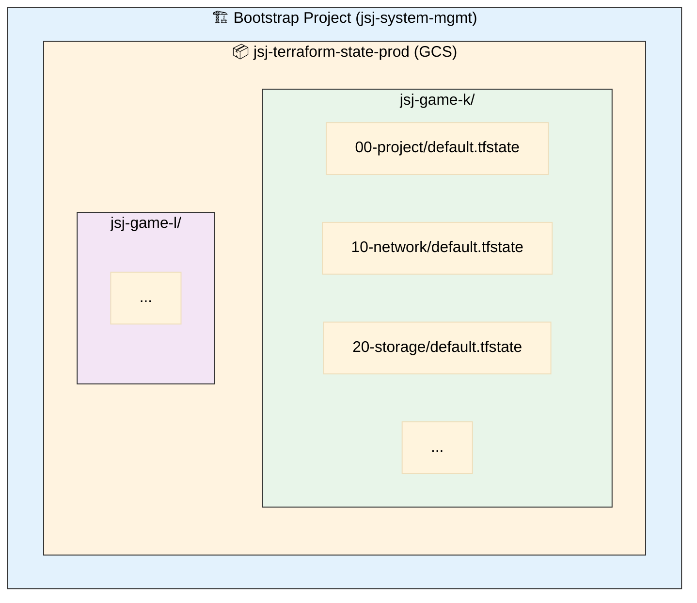

# State 관리 아키텍처

Terraform State의 중앙 집중식 관리 전략입니다.

## 아키텍처 개요



## 핵심 원칙

### 1. 중앙 집중식 (Centralized)

모든 프로젝트의 State를 단일 버킷에서 관리:

- **장점**: 일관된 관리, 쉬운 백업, 팀 협업
- **버킷**: `jsj-terraform-state-prod`
- **프로젝트**: `jsj-system-mgmt`

### 2. 레이어별 분리 (Layer Isolation)

각 레이어는 독립적인 State 파일 보유:

- **장점**: 빠른 Plan/Apply, 독립적 변경, 충돌 방지
- **예시**: `00-project`, `10-network`, ... `70-loadbalancer`

### 3. 환경별 격리 (Environment Isolation)

프로젝트별로 prefix 분리:

- **장점**: 환경 간 간섭 없음, 독립적 관리
- **예시**: `jsj-game-k/`, `jsj-game-l/`

## State 구조

### GCS 버킷 구조

```text
gs://jsj-terraform-state-prod/
├── bootstrap/                        # Bootstrap State (복사본)
│   └── default.tfstate
├── jsj-game-k/                       # 환경 1
│   ├── 00-project/
│   │   └── default.tfstate
│   ├── 10-network/
│   │   └── default.tfstate
│   ├── 20-storage/
│   │   └── default.tfstate
│   └── ...
├── jsj-game-l/                       # 환경 2
│   └── ...
└── proj-default-templet/             # 템플릿 (테스트용)
    └── ...
```

### 버킷 설정

```hcl
resource "google_storage_bucket" "terraform_state" {
  name     = "jsj-terraform-state-prod"
  location = "ASIA"

  versioning {
    enabled = true  # 버전 관리
  }

  lifecycle_rule {
    condition {
      num_newer_versions = 10  # 최근 10개 보관
    }
    action {
      type = "Delete"
    }
  }

  lifecycle_rule {
    condition {
      age = 30  # 30일 지난 버전 삭제
    }
    action {
      type = "Delete"
    }
  }

  uniform_bucket_level_access = true
  public_access_prevention    = "enforced"
}
```

## Terragrunt 자동화

### root.hcl (환경 루트)

```hcl
remote_state {
  backend = "gcs"
  generate = {
    path      = "backend.tf"
    if_exists = "overwrite_terragrunt"
  }
  config = {
    project  = "jsj-system-mgmt"
    location = "asia"
    bucket   = "jsj-terraform-state-prod"
    prefix   = "jsj-game-k/${path_relative_to_include()}"
  }
}
```

**효과**:

- 각 레이어에 `backend.tf` 자동 생성
- Terraform 코드에 backend 블록 불필요
- State 경로 자동 계산

### 생성되는 backend.tf

```hcl
# 00-project/backend.tf (자동 생성)
terraform {
  backend "gcs" {
    bucket = "jsj-terraform-state-prod"
    prefix = "jsj-game-k/00-project"
  }
}
```

## State 보호

### Versioning

- ✅ 모든 변경 사항 버전 관리
- ✅ 최근 10개 버전 보관
- ✅ 30일 이상 된 버전 자동 삭제

### 백업 전략

```bash
# 자동 백업 (Versioning으로)
# → GCS가 자동으로 관리

# 수동 백업 (중요 변경 전)
gsutil cp \
    gs://jsj-terraform-state-prod/jsj-game-k/00-project/default.tfstate \
    gs://jsj-terraform-state-prod/backup/jsj-game-k-00-project-$(date +%Y%m%d).tfstate
```

### Lock 메커니즘

- **방법**: GCS 자동 제공
- **효과**: 동시 실행 방지
- **파일**: `default.tflock`

## Bootstrap State (특별 케이스)

### 로컬 State

Bootstrap은 의도적으로 로컬 State 사용:

```hcl
# bootstrap/main.tf
terraform {
  # backend 블록 없음 = 로컬 State
}
```

**이유**:

- Bootstrap이 State 버킷을 생성함
- 순환 의존성 방지

### 백업 필수

```bash
# 로컬 백업
cd bootstrap
cp terraform.tfstate ~/backup/bootstrap-$(date +%Y%m%d).tfstate

# GCS 백업 (권장)
gsutil cp terraform.tfstate \
    gs://jsj-terraform-state-prod/bootstrap/default.tfstate
```

### 참조 방법

다른 레이어에서 Bootstrap State 참조:

```hcl
data "terraform_remote_state" "bootstrap" {
  backend = "gcs"
  config = {
    bucket = "jsj-terraform-state-prod"
    prefix = "bootstrap"
  }
}

locals {
  state_bucket = data.terraform_remote_state.bootstrap.outputs.state_bucket_name
}
```

## State 복구

### 이전 버전 복원

```bash
# 1. 버전 리스트 확인
gsutil ls -la gs://jsj-terraform-state-prod/jsj-game-k/00-project/

# 2. 특정 버전 복원
STATE_OBJECT="gs://jsj-terraform-state-prod/jsj-game-k/00-project/default.tfstate#1234567890"
gsutil cp \
    "${STATE_OBJECT}" \
    gs://jsj-terraform-state-prod/jsj-game-k/00-project/default.tfstate
```

### Bootstrap State 복원

```bash
cd bootstrap

# 로컬 백업에서
cp ~/backup/bootstrap-20251112.tfstate terraform.tfstate

# GCS에서
gsutil cp gs://jsj-terraform-state-prod/bootstrap/default.tfstate \
    terraform.tfstate
```

## State 이동

### 프로젝트 간 이동

```bash
# 1. State Pull
cd old-project
terragrunt state pull > state.json

# 2. State 수정 (prefix 변경)
# state.json 편집

# 3. State Push
cd new-project
terragrunt state push state.json
```

### 리소스 이동

```bash
# 레이어 간 리소스 이동
terragrunt state mv \
    -state=../20-storage/terraform.tfstate \
    -state-out=../30-security/terraform.tfstate \
    google_storage_bucket.logs \
    google_storage_bucket.logs
```

## 모니터링

### State 크기 확인

```bash
gsutil du -sh gs://jsj-terraform-state-prod/jsj-game-k/
```

### 변경 이력

```bash
# Versioning 이력
gsutil ls -la gs://jsj-terraform-state-prod/jsj-game-k/00-project/ | tail -10
```

### Lock 확인

```bash
gsutil ls gs://jsj-terraform-state-prod/jsj-game-k/**/*.tflock
```

## 베스트 프랙티스

### ✅ Do

1. **Versioning 활성화**: 항상 켜기
2. **정기 백업**: 중요 변경 전
3. **Lock 존중**: 강제 해제 최소화
4. **레이어 분리**: 작은 State 유지
5. **Terragrunt 사용**: 자동화로 실수 방지

### ❌ Don't

1. **로컬 State 사용 금지** (Bootstrap 제외)
2. **State 직접 수정 금지**: `terraform state` 명령 사용
3. **Lock 무시 금지**: 충돌 위험
4. **여러 환경 공유 금지**: prefix 분리
5. **버전 삭제 금지**: Versioning 활용

## 트러블슈팅

### "bucket doesn't exist"

→ [일반적인 오류](../troubleshooting/common-errors.md#1-storage-bucket-doesnt-exist)

### Lock 걸림

→ [State 문제](../troubleshooting/state-issues.md#state-lock-문제)

### State 손상

→ [State 문제](../troubleshooting/state-issues.md#state-손상)

---

**관련 문서**:

- [전체 아키텍처](./overview.md)
- [Bootstrap 설정](../getting-started/bootstrap-setup.md)
- [State 문제 해결](../troubleshooting/state-issues.md)
