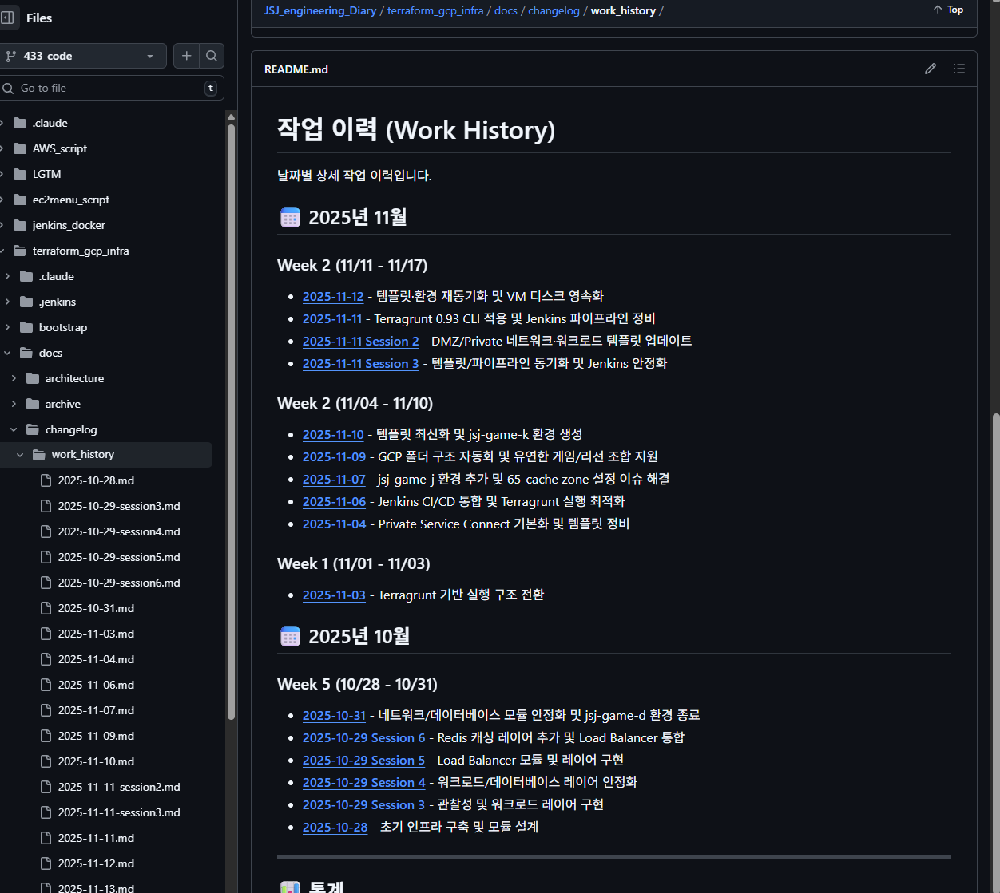

# 작업 이력 - 2025-11-13

**작업자**: jsj  
**브랜치**: 433_code

---

## 🎯 작업 요약
- jsj-game-l 환경의 `70-loadbalancer`에 auto instance group 로직을 복구하고 Jenkins 컨테이너에서 Terragrunt로 직접 검증
- 폐기된 jsj-game-k 환경 전체를 레포에서 제거
- 문서 전반에 남아 있던 Codex/Claude 표기를 jsj로 통일하고 load balancer 관련 README를 최신화

---

## ✅ 완료된 작업
1. **로드밸런서 자동 백엔드 복구**
   - 템플릿과 jsj-game-l의 `main.tf`, `variables.tf`, `README.md`를 동기화해 `auto_instance_groups` 입력을 `local.auto_backends`로 합산
   - Jenkins 컨테이너에서 bootstrap 키를 사용해 `terragrunt run -- console`로 `local.auto_backends`에 8개 IG가 모두 포함되는지 확인
2. **jsj-game-k 환경 삭제**
   - `/terraform_gcp_infra/environments/LIVE/jsj-game-k` 전체를 삭제하고 `chore: jsj-game-k 환경 제거` 커밋으로 반영
3. **문서/작업자 표기 정리**
   - load balancer README에 auto 등록 주의사항을 포함하고 템플릿과 jsj-game-l 버전을 맞춤
   - WORK_HISTORY 포함 다수의 `.md`에서 작업자 표기를 jsj로 통일 (`docs: 문서 재구성 반영`, `docs: 작업자 표기 정리` 커밋)

---

## 🐛 해결한 이슈
- 70-loadbalancer가 50-workloads의 instance group 출력을 사용하지 않아 자동 등록이 동작하지 않던 문제 → 템플릿 최신 코드로 교체해 해결
- 문서 곳곳에 Codex/Claude 표기가 남아 있어 히스토리 추적이 어려웠던 문제 → 모두 jsj로 정리
- 폐기된 jsj-game-k 환경이 남아 있어 혼선을 주던 문제 → 디렉터리 삭제 및 커밋 완료

---

## 🔗 관련 커밋
- `chore: jsj-game-k 환경 제거`
- `docs: 문서 재구성 반영`
- `docs: 작업자 표기 정리`

---

## 📌 추가 메모
- Jenkins 컨테이너에서 Terragrunt를 수동 실행할 때는 `/tmp/jenkins-sa-key.json`에 bootstrap 키를 복사한 후 `GOOGLE_APPLICATION_CREDENTIALS`를 export 해야 함 (작업 후 키 파일은 삭제 완료)
- jsj-game-l에서 `terragrunt run --queue-include-dir '70-loadbalancer' --all apply`를 한 번 더 실행하면 자동 백엔드 구성이 실환경 GCP에도 반영됨

