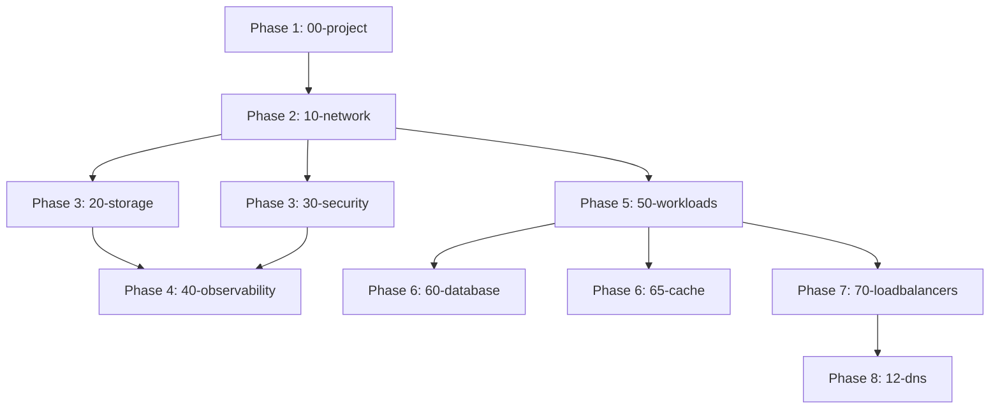

# Terragrunt 사용 가이드

Terragrunt는 Terraform wrapper로 DRY(Don't Repeat Yourself) 원칙을 따르며 State 관리를 자동화합니다.

## 왜 Terragrunt를 사용하는가?

### 문제: Terraform만 사용 시

```hcl
# 각 레이어마다 backend 블록 중복
terraform {
  backend "gcs" {
    bucket = "jsj-terraform-state-prod"
    prefix = "jsj-game-n/00-project"
  }
}

# 공통 변수를 각 레이어에서 반복
variable "project_id" { default = "jsj-game-n" }
variable "region" { default = "asia-northeast3" }
# ... 10개 레이어 × 10개 변수 = 100번 반복
```

### 해결: Terragrunt 사용

```hcl
# root.hcl (한 곳에만 정의)
remote_state {
  backend = "gcs"
  config = {
    bucket = "jsj-terraform-state-prod"
    prefix = "jsj-game-n/${path_relative_to_include()}"
  }
}

inputs = {
  project_id = "jsj-game-n"
  region     = "asia-northeast3"
}
```

## 디렉터리 구조

```text
environments/LIVE/jsj-game-n/
├── root.hcl                    # 루트 설정 (remote_state, inputs)
├── common.naming.tfvars        # 공통 네이밍 변수
├── 00-project/
│   ├── terragrunt.hcl          # 레이어 설정
│   ├── main.tf                 # Terraform 코드
│   ├── variables.tf
│   ├── outputs.tf
│   └── terraform.tfvars        # 레이어별 변수
├── 10-network/
│   ├── terragrunt.hcl
│   └── ...
└── ... (20-storage ~ 12-dns)
```

## Terragrunt 0.93+ Migration Guide

### 주요 구문 변경사항

Terragrunt 0.93부터 명령어 구문이 변경되었습니다:

| 기능 | 구버전 (< 0.93) | 신버전 (0.93+) |
|------|----------------|----------------|
| 전체 실행 | `run-all plan` | `run --all -- plan` |
| 디렉토리 포함 | `--terragrunt-include-dir` | `--queue-include-dir` |
| 디렉토리 제외 | `--terragrunt-exclude-dir` | `--queue-exclude-dir` |
| Working Directory | `--terragrunt-working-dir` | `--working-dir` |
| Non-Interactive | `--terragrunt-non-interactive` | (환경변수 사용 권장) |

### 마이그레이션 예제

```bash
# 구버전 (< 0.93)
terragrunt run-all plan
terragrunt run-all apply --terragrunt-include-dir 10-network
terragrunt run-all --terragrunt-working-dir envs/LIVE/jsj-game-n apply

# 신버전 (0.93+)
terragrunt run --all -- plan
terragrunt run --all --queue-include-dir 10-network -- apply
terragrunt run --all --working-dir envs/LIVE/jsj-game-n -- apply
```

**⚠️ 중요**:
- Terraform 명령어 앞에 `--` 구분자 필요
- Terragrunt 옵션은 `--` 앞에, Terraform 옵션은 `--` 뒤에 위치

### CI/CD 파이프라인 업데이트

```bash
# Jenkins, GitHub Actions 등에서 사용 시
export TG_NON_INTERACTIVE=true  # 환경변수로 non-interactive 모드 활성화

terragrunt run --all \
  --working-dir terraform_gcp_infra/environments/LIVE/jsj-game-n \
  --queue-include-dir 50-workloads \
  -- apply -- -auto-approve
```

## 설정 파일 설명

### root.hcl (환경 루트)

**역할**: 전체 환경의 공통 설정

```hcl
# Remote State 자동 설정
remote_state {
  backend = "gcs"
  generate = {
    path      = "backend.tf"      # 자동 생성될 파일명
    if_exists = "overwrite_terragrunt"
  }
  config = {
    project  = "jsj-system-mgmt"
    location = "asia"
    bucket   = "jsj-terraform-state-prod"
    prefix   = "jsj-game-n/${path_relative_to_include()}"
  }
}

# 모든 레이어에 전달할 공통 입력
inputs = {
  org_id          = ""
  billing_account = "01076D-327AD5-FC8922"
  region_primary  = "asia-northeast3"
  region_backup   = "asia-northeast1"
}
```

**결과**: 각 레이어에 `backend.tf` 자동 생성

```hcl
# 00-project/backend.tf (자동 생성됨)
terraform {
  backend "gcs" {
    bucket = "jsj-terraform-state-prod"
    prefix = "jsj-game-n/00-project"
  }
}
```

### terragrunt.hcl (레이어별)

**역할**: 레이어 특화 설정

```hcl
# 루트 설정 상속
include "root" {
  path = find_in_parent_folders("root.hcl")
}

# 의존성 선언
dependencies {
  paths = ["../00-project"]
}

# 의존 레이어 Output 참조
dependency "project" {
  config_path = "../00-project"
}

# 추가 입력 (root.hcl inputs와 병합)
inputs = {
  project_id = dependency.project.outputs.project_id
}
```

## 기본 명령어 (Terragrunt 0.93+)

### 단일 레이어 실행

```bash
cd environments/LIVE/jsj-game-n/00-project

# 초기화 (backend.tf 자동 생성)
terragrunt init --non-interactive

# Plan
terragrunt plan

# Apply
terragrunt apply

# Destroy
terragrunt destroy
```

### 전체 스택 실행

```bash
cd environments/LIVE/jsj-game-n

# 모든 레이어 Plan (의존 순서대로)
terragrunt run --all -- plan

# 모든 레이어 Apply
terragrunt run --all -- apply

# 모든 레이어 Destroy (역순)
terragrunt run --all -- destroy

# 특정 레이어만 Plan
terragrunt run --all --queue-include-dir 00-project -- plan

# 여러 레이어 선택
terragrunt run --all \
  --queue-include-dir 00-project \
  --queue-include-dir 10-network \
  -- apply
```

### Phase 기반 배포 (권장)

```bash
# Phase 1 (00-project)
terragrunt run --all --queue-include-dir 00-project -- apply

# Phase 2 (10-network)
terragrunt run --all --queue-include-dir 10-network -- apply

# Phase 3 (20-storage + 30-security)
terragrunt run --all \
  --queue-include-dir 20-storage \
  --queue-include-dir 30-security \
  -- apply

# Phase 4 (40-observability, Optional)
terragrunt run --all --queue-include-dir 40-observability -- apply

# Phase 5 (50-workloads)
terragrunt run --all --queue-include-dir 50-workloads -- apply

# Phase 6 (60-database + 65-cache)
terragrunt run --all \
  --queue-include-dir 60-database \
  --queue-include-dir 65-cache \
  -- apply

# Phase 7 (70-loadbalancers)
terragrunt run --all --queue-include-dir 70-loadbalancers -- apply

# Phase 8 (12-dns)
terragrunt run --all --queue-include-dir 12-dns -- apply
```

### 비대화식 실행 (CI/CD용)

```bash
# 환경변수 사용 (권장)
export TG_NON_INTERACTIVE=true
terragrunt run --all -- apply

# Working Directory 지정
terragrunt run --all \
  --working-dir terraform_gcp_infra/environments/LIVE/jsj-game-n \
  -- plan
```

## Phase 기반 배포와 Terragrunt 통합

### Phase 순서와 의존성

Terragrunt는 Phase 기반 배포의 핵심 도구입니다:



### Jenkins와의 통합

```groovy
// Jenkinsfile에서 Phase 정의
def PHASES = [
    [id: 'phase1', label: 'Phase 1: Project', dirs: ['00-project']],
    [id: 'phase2', label: 'Phase 2: Network', dirs: ['10-network']],
    [id: 'phase3', label: 'Phase 3: Storage & Security', dirs: ['20-storage', '30-security']],
    // ... 나머지 Phases
]

// Phase별 실행
def runPhasePlan(phase, dirs) {
    dirs.each { dir ->
        sh """
            cd ${TG_WORKING_DIR}
            terragrunt run --all --queue-include-dir ${dir} -- plan -out=tfplan-${phase.id}
        """
    }
}
```

### 자동화 예제: subnet_type 매핑

```hcl
# 50-workloads/terragrunt.hcl
dependency "network" {
  config_path = "../10-network"
}

locals {
  # subnet_type 기반 자동 매핑
  subnet_type = "dmz"  # dmz, private, db 중 선택
}

inputs = {
  # 자동으로 10-network outputs에서 해당 서브넷 참조
  subnetwork_self_link = dependency.network.outputs.subnets[local.subnet_type].self_link
  secondary_ranges     = dependency.network.outputs.subnets[local.subnet_type].secondary_ranges
}
```

**지원되는 subnet_type:**
- `dmz`: Public facing 워크로드 (Web servers)
- `private`: Application 레이어 (App servers, Redis)
- `db`: Database 레이어 (Cloud SQL)

## 변수 병합 순서

Terragrunt는 다음 순서로 변수를 병합합니다:

```text
1. root.hcl inputs
   ↓
2. common.naming.tfvars (auto-loaded)
   ↓
3. terragrunt.hcl inputs
   ↓
4. terraform.tfvars
   ↓
5. 최종 Terraform 실행
```

**예시**:

```hcl
# root.hcl
inputs = {
  region = "asia-northeast3"  # 1순위
}

# common.naming.tfvars
project_id = "jsj-game-n"     # 2순위

# 00-project/terragrunt.hcl
inputs = {
  project_name = "game-n"     # 3순위
}

# 00-project/terraform.tfvars
enable_budget = true          # 4순위

# 최종 결과:
# region = "asia-northeast3"
# project_id = "jsj-game-n"
# project_name = "game-n"
# enable_budget = true
```

## 의존성 관리

### dependencies 블록

```hcl
# 10-network/terragrunt.hcl
dependencies {
  paths = ["../00-project"]
}
```

**효과**:

- `terragrunt run --all -- apply` 실행 시 00-project 먼저 실행
- 00-project 실패 시 10-network 실행 안 됨

### dependency 블록

```hcl
# 50-workloads/terragrunt.hcl
dependency "network" {
  config_path = "../10-network"
}

dependency "security" {
  config_path = "../30-security"
}

inputs = {
  vpc_name = dependency.network.outputs.vpc_name
  subnet_self_link = dependency.network.outputs.subnets["dmz"].self_link
  service_account_email = dependency.security.outputs.service_account_emails["compute"]
}
```

**효과**:

- 다른 레이어의 Output을 변수로 전달
- Type-safe (Output이 없으면 오류)

## 고급 기능

### Mock Outputs (Plan 가속화)

```hcl
dependency "network" {
  config_path = "../10-network"

  # Plan 시 실제 Output 대신 Mock 사용
  mock_outputs = {
    vpc_name = "mock-vpc"
    subnets = {
      dmz = {
        self_link = "mock-subnet-dmz"
        secondary_ranges = []
      }
    }
  }
  mock_outputs_allowed_terraform_commands = ["validate", "plan"]
}
```

**주의**: Phase 기반 배포에서는 실제 리소스가 순차적으로 생성되므로 mock outputs를 덜 사용하게 됩니다.

### 환경변수 기반 Dependency 제어

**문제**: `run --all -- destroy` 시 dependency가 먼저 삭제되어 outputs를 읽을 수 없음

**해결**: 환경변수로 `skip_outputs` 동적 제어

```hcl
# 70-loadbalancers/app/terragrunt.hcl
dependency "workloads" {
  config_path = "../../50-workloads"

  # 환경변수로 outputs 읽기 제어
  skip_outputs = get_env("SKIP_WORKLOADS_DEPENDENCY", "false") == "true"

  mock_outputs = {
    instance_groups = {}
  }

  mock_outputs_allowed_terraform_commands = ["validate", "plan"]
}

inputs = {
  # try()로 안전하게 처리
  auto_instance_groups = {
    for name, link in try(dependency.workloads.outputs.instance_groups, {}) :
    name => link
    if length(regexall("app", lower(name))) > 0
  }
}
```

**사용법**:

```bash
# 일반 사용 (자동 매핑)
terragrunt apply

# Destroy 시 (환경변수 설정)
export SKIP_WORKLOADS_DEPENDENCY=true
terragrunt run --all -- destroy
```

**효과**:
- 일반 사용: dependency outputs 자동 읽기
- Destroy: 환경변수 설정으로 outputs 건너뛰기
- 유연성: 필요할 때만 환경변수 사용

### 조건부 실행

```hcl
# 특정 환경에서만 적용
skip = get_env("SKIP_OBSERVABILITY", "false") == "true"
```

### 동적 변수 생성

```hcl
locals {
  environment = basename(get_terragrunt_dir())
  region = get_env("REGION", "asia-northeast3")
}

inputs = {
  tags = {
    Environment = local.environment
    ManagedBy = "terragrunt"
  }
}
```

## Terragrunt vs Terraform

| 기능 | Terraform | Terragrunt |
|------|-----------|-----------|
| Backend 설정 | 각 모듈에 중복 | root.hcl 한 곳 |
| 공통 변수 | 수동 복사 | inputs 자동 병합 |
| 의존성 | 수동 관리 | dependencies 자동 |
| 실행 순서 | 수동 | `run --all` 자동 정렬 |
| State 관리 | 수동 prefix | path 자동 계산 |
| 버전 관리 | 0.93+ 구문 | 이전 버전과 호환성 주의 |

## 베스트 프랙티스

### 1. 환경별 root.hcl 사용

```text
environments/
├── LIVE/
│   ├── jsj-game-n/
│   │   └── root.hcl  (project_id = "jsj-game-n")
│   └── jsj-game-m/
│       └── root.hcl  (project_id = "jsj-game-m")
```

### 2. 공통 설정은 상위에

```hcl
# environments/root.hcl
inputs = {
  organization = "433"
  billing_account = "01076D-327AD5-FC8922"
}

# environments/LIVE/jsj-game-n/root.hcl
include "common" {
  path = find_in_parent_folders("root.hcl")
}

inputs = {
  project_id = "jsj-game-n"
}
```

### 3. 민감한 정보는 환경변수

```hcl
inputs = {
  db_password = get_env("DB_PASSWORD", "")
}
```

### 4. Phase 기반 배포 사용

```bash
# 전체 배포는 Phase 순서대로
for phase in 00-project 10-network 20-storage 30-security \
             40-observability 50-workloads 60-database 65-cache \
             70-loadbalancers 12-dns; do
  terragrunt run --all --queue-include-dir $phase -- apply
done
```

### 5. State Lock 주의

```bash
# 동일 레이어를 여러 곳에서 동시 실행 금지
# CI/CD에서 Queue 사용
```

## 디버깅

### 상세 로그

```bash
export TERRAGRUNT_LOG_LEVEL=debug
export TF_LOG=DEBUG
terragrunt plan
```

### 설정 검증

```bash
# 병합된 입력 확인
terragrunt output-all

# Dependency 그래프 확인
terragrunt graph-dependencies | dot -Tpng > graph.png
```

### 캐시 정리

```bash
# .terragrunt-cache 삭제
find . -type d -name ".terragrunt-cache" -prune -exec rm -rf {} \;

# Terraform 캐시도 정리
find . -type d -name ".terraform" -prune -exec rm -rf {} \;
```

## 마이그레이션 (Terraform → Terragrunt)

### 1. 기존 Backend 제거

```hcl
# main.tf에서 삭제
# terraform {
#   backend "gcs" { ... }
# }
```

### 2. terragrunt.hcl 생성

```hcl
include "root" {
  path = find_in_parent_folders("root.hcl")
}
```

### 3. State 확인

```bash
# 기존 State 그대로 사용됨
terragrunt init
terragrunt plan  # No changes expected
```

## 참고 자료

### 공식 문서
- [Terragrunt 0.93+ 공식 문서](https://terragrunt.gruntwork.io/docs/)
- [Terragrunt Migration Guide](https://terragrunt.gruntwork.io/docs/getting-started/migrating-from-terraform/)

### 관련 문서
- [Jenkins CI/CD 가이드](./jenkins-cicd.md) - Phase 기반 배포
- [첫 배포 가이드](../getting-started/first-deployment.md) - 단계별 배포
- [트러블슈팅](../troubleshooting/common-errors.md) - 일반적인 오류 해결

---

**Last Updated: 2025-11-21**
**Version: Terragrunt 0.93+ Compatible**
