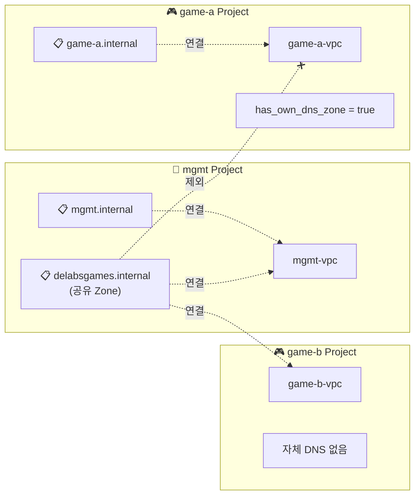

# Cloud DNS 모듈

이 모듈은 Google Cloud DNS Managed Zone과 DNS 레코드를 생성하고 관리합니다. Public 및 Private DNS Zone 모두 지원하며, DNSSEC, DNS Forwarding, DNS Peering 등의 고급 기능도 제공합니다.

## 기능

- **Managed Zone**: Public 및 Private DNS Zone 생성
- **DNS 레코드**: A, AAAA, CNAME, MX, TXT, SRV 등 다양한 레코드 타입 지원
- **Private DNS Zone**: VPC 네트워크 내에서만 해석 가능한 프라이빗 Zone
- **DNSSEC**: Public Zone의 DNS 보안 확장 (Domain Name System Security Extensions)
- **DNS Forwarding**: Private Zone에서 외부 DNS 서버로 쿼리 전달
- **DNS Peering**: 다른 VPC의 DNS Zone과 연결
- **DNS Policy**: Inbound Forwarding, DNS 로깅 등 고급 정책 설정

## 사용법

### Public DNS Zone (기본)

```hcl
module "public_dns" {
  source = "../../modules/cloud-dns"

  project_id  = "my-project-id"
  zone_name   = "example-zone"
  dns_name    = "example.com."

  description = "Example.com public DNS zone"

  dns_records = [
    {
      name    = "www"
      type    = "A"
      ttl     = 300
      rrdatas = ["203.0.113.10"]
    },
    {
      name    = "mail"
      type    = "MX"
      ttl     = 3600
      rrdatas = ["10 mail.example.com."]
    }
  ]

  labels = {
    environment = "prod"
    managed_by  = "terraform"
  }
}
```

### Private DNS Zone (VPC 내부용)

```hcl
module "private_dns" {
  source = "../../modules/cloud-dns"

  project_id  = "my-project-id"
  zone_name   = "internal-zone"
  dns_name    = "internal.example.com."
  visibility  = "private"

  description = "Internal private DNS zone"

  # Private Zone이 접근 가능한 VPC 네트워크 목록
  private_networks = [
    "projects/my-project-id/global/networks/my-vpc",
    "projects/other-project/global/networks/shared-vpc"
  ]

  dns_records = [
    {
      name    = "db-master"
      type    = "A"
      ttl     = 300
      rrdatas = ["10.0.1.10"]
    },
    {
      name    = "redis-cache"
      type    = "A"
      ttl     = 300
      rrdatas = ["10.0.2.20"]
    }
  ]

  labels = {
    environment = "prod"
    purpose     = "internal-services"
  }
}
```

### Cross-Project Private DNS (여러 프로젝트에서 공유)

```hcl
module "shared_private_dns" {
  source = "../../modules/cloud-dns"

  project_id  = "mgmt-project-id"
  zone_name   = "delabsgames-internal"
  dns_name    = "delabsgames.internal."
  visibility  = "private"

  description = "Shared internal DNS zone for all game projects"

  # 여러 프로젝트의 VPC에서 접근 가능
  private_networks = [
    "projects/mgmt-project/global/networks/mgmt-vpc",
    "projects/game-project-a/global/networks/game-a-vpc",
    "projects/game-project-b/global/networks/game-b-vpc"
  ]

  # PSC 엔드포인트용 DNS 레코드
  dns_records = [
    {
      name    = "gcby-live-gdb-m1"    # Cloud SQL Primary
      type    = "A"
      ttl     = 300
      rrdatas = ["10.250.20.51"]      # PSC Endpoint IP
    },
    {
      name    = "gcby-live-cache"     # Redis Cache
      type    = "A"
      ttl     = 300
      rrdatas = ["10.250.20.101"]     # PSC Endpoint IP
    }
  ]

  labels = {
    environment = "prod"
    purpose     = "psc-dns"
  }
}
```

### DNSSEC 활성화 (Public Zone)

```hcl
module "secure_dns" {
  source = "../../modules/cloud-dns"

  project_id    = "my-project-id"
  zone_name     = "secure-zone"
  dns_name      = "secure.example.com."
  enable_dnssec = true

  # 커스텀 DNSSEC 키 사양 (선택사항)
  dnssec_key_specs = [
    {
      algorithm  = "rsasha256"
      key_length = 2048
      key_type   = "keySigning"
    },
    {
      algorithm  = "rsasha256"
      key_length = 2048
      key_type   = "zoneSigning"
    }
  ]

  dns_records = [
    {
      name    = "@"
      type    = "A"
      ttl     = 300
      rrdatas = ["203.0.113.50"]
    }
  ]
}
```

### DNS Forwarding (온프레미스 DNS 연동)

```hcl
module "forwarding_dns" {
  source = "../../modules/cloud-dns"

  project_id  = "my-project-id"
  zone_name   = "onprem-zone"
  dns_name    = "corp.internal."
  visibility  = "private"

  description = "Forward queries to on-premises DNS servers"

  private_networks = [
    "projects/my-project-id/global/networks/my-vpc"
  ]

  # 온프레미스 DNS 서버로 쿼리 전달
  target_name_servers = [
    {
      ipv4_address    = "192.168.1.53"
      forwarding_path = "private"  # VPN/Interconnect를 통해 전달
    },
    {
      ipv4_address    = "192.168.1.54"
      forwarding_path = "private"
    }
  ]
}
```

### DNS Peering (다른 VPC의 DNS 참조)

```hcl
module "peering_dns" {
  source = "../../modules/cloud-dns"

  project_id  = "consumer-project"
  zone_name   = "peered-zone"
  dns_name    = "shared.internal."
  visibility  = "private"

  description = "Peer to shared services VPC DNS"

  private_networks = [
    "projects/consumer-project/global/networks/consumer-vpc"
  ]

  # 다른 VPC의 DNS Zone을 참조
  peering_network = "projects/shared-services-project/global/networks/shared-vpc"
}
```

### DNS Policy (Inbound Forwarding 및 로깅)

```hcl
module "dns_with_policy" {
  source = "../../modules/cloud-dns"

  project_id  = "my-project-id"
  zone_name   = "policy-zone"
  dns_name    = "policy.internal."
  visibility  = "private"

  private_networks = [
    "projects/my-project-id/global/networks/my-vpc"
  ]

  # DNS Policy 생성
  create_dns_policy          = true
  dns_policy_name            = "my-dns-policy"
  dns_policy_description     = "DNS policy with logging and inbound forwarding"
  enable_inbound_forwarding  = true   # 외부에서 VPC DNS로 쿼리 가능
  enable_dns_logging         = true   # DNS 쿼리 로깅

  dns_policy_networks = [
    "projects/my-project-id/global/networks/my-vpc"
  ]

  # 대체 네임서버 (선택사항)
  alternative_name_servers = [
    {
      ipv4_address    = "8.8.8.8"
      forwarding_path = "default"
    }
  ]
}
```

## 입력 변수

| 이름 | 설명 | 타입 | 기본값 | 필수 |
|------|------|------|--------|:----:|
| project_id | GCP 프로젝트 ID | `string` | n/a | yes |
| zone_name | DNS Managed Zone 이름 (GCP 리소스명) | `string` | n/a | yes |
| dns_name | DNS 도메인 이름 (반드시 `.`으로 끝나야 함) | `string` | n/a | yes |
| description | Managed Zone 설명 | `string` | `""` | no |
| visibility | Zone 가시성 (`public` 또는 `private`) | `string` | `"public"` | no |
| private_networks | Private Zone 접근 가능 VPC 목록 | `list(string)` | `[]` | no |
| enable_dnssec | DNSSEC 활성화 (Public Zone에서만) | `bool` | `false` | no |
| dnssec_key_specs | DNSSEC 키 사양 | `list(object)` | 아래 참조 | no |
| target_name_servers | Forwarding 대상 DNS 서버 목록 | `list(object)` | `[]` | no |
| peering_network | Peering할 VPC 네트워크 self-link | `string` | `""` | no |
| labels | Managed Zone 라벨 | `map(string)` | `{}` | no |
| dns_records | DNS 레코드 목록 | `list(object)` | `[]` | no |
| create_dns_policy | DNS Policy 생성 여부 | `bool` | `false` | no |
| dns_policy_name | DNS Policy 이름 | `string` | `""` | no |
| dns_policy_description | DNS Policy 설명 | `string` | `""` | no |
| enable_inbound_forwarding | Inbound DNS forwarding 활성화 | `bool` | `false` | no |
| enable_dns_logging | DNS 쿼리 로깅 활성화 | `bool` | `false` | no |
| alternative_name_servers | DNS Policy 대체 네임서버 | `list(object)` | `[]` | no |
| dns_policy_networks | DNS Policy 적용 VPC 네트워크 목록 | `list(string)` | `[]` | no |

### DNS 레코드 객체 구조

```hcl
{
  name    = string           # 레코드 이름 (호스트 부분만, 예: "www", "mail")
  type    = string           # 레코드 타입 (A, AAAA, CNAME, MX, TXT, SRV 등)
  ttl     = optional(number) # TTL (초), 기본값 300
  rrdatas = list(string)     # 레코드 데이터 (타입에 따라 다름)
}
```

### 기본 DNSSEC 키 사양

```hcl
dnssec_key_specs = [
  {
    algorithm  = "rsasha256"
    key_length = 2048
    key_type   = "keySigning"
  },
  {
    algorithm  = "rsasha256"
    key_length = 2048
    key_type   = "zoneSigning"
  }
]
```

## 출력 값

| 이름 | 설명 |
|------|------|
| zone_name | 생성된 Managed Zone 이름 |
| zone_id | Managed Zone ID |
| dns_name | DNS 도메인 이름 |
| name_servers | 네임서버 목록 (Public Zone에서만) |
| visibility | Zone 가시성 |
| managed_zone_id | GCP 리소스 ID |
| dns_records | 생성된 DNS 레코드 정보 |
| dns_policy_id | DNS Policy ID (생성된 경우) |
| dns_policy_name | DNS Policy 이름 (생성된 경우) |

## DNS 레코드 타입 가이드

### A 레코드 (IPv4 주소)
```hcl
{
  name    = "www"
  type    = "A"
  ttl     = 300
  rrdatas = ["203.0.113.10", "203.0.113.11"]  # 여러 IP 가능
}
```

### AAAA 레코드 (IPv6 주소)
```hcl
{
  name    = "www"
  type    = "AAAA"
  ttl     = 300
  rrdatas = ["2001:db8::1"]
}
```

### CNAME 레코드 (별칭)
```hcl
{
  name    = "alias"
  type    = "CNAME"
  ttl     = 300
  rrdatas = ["www.example.com."]  # FQDN으로 끝나야 함
}
```

### MX 레코드 (메일 서버)
```hcl
{
  name    = ""  # 루트 도메인
  type    = "MX"
  ttl     = 3600
  rrdatas = ["10 mail1.example.com.", "20 mail2.example.com."]  # 우선순위 + FQDN
}
```

### TXT 레코드 (텍스트)
```hcl
{
  name    = ""
  type    = "TXT"
  ttl     = 300
  rrdatas = ["\"v=spf1 include:_spf.google.com ~all\""]  # 따옴표로 감싸야 함
}
```

### SRV 레코드 (서비스 위치)
```hcl
{
  name    = "_ldap._tcp"
  type    = "SRV"
  ttl     = 300
  rrdatas = ["10 0 389 ldap.example.com."]  # 우선순위 가중치 포트 타겟
}
```

## 아키텍처 패턴

### Per-VPC Private DNS Zone 패턴

각 프로젝트/VPC에서 자체 Private DNS Zone을 관리하고, 필요한 경우에만 공유합니다.



**설명:**

- **mgmt Project**: 자체 DNS Zone(`mgmt.internal`) + 공유 Zone(`delabsgames.internal`) 관리
- **game-b Project**: 자체 DNS 없음 → 공유 Zone 사용
- **game-a Project**: `has_own_dns_zone = true` → 공유 Zone에서 제외 (DNS 충돌 방지)

### DNS 충돌 방지 패턴

동일한 DNS 이름을 가진 Zone이 여러 VPC에 연결될 때 충돌을 방지합니다.

```hcl
# bootstrap/common.hcl에서 프로젝트별 설정
projects = {
  gcby = {
    project_id       = "gcp-gcby"
    vpc_name         = "gcby-live-vpc"
    has_own_dns_zone = true  # 자체 DNS Zone 있음 - 공유 Zone에서 제외
  }
  game2 = {
    project_id       = "gcp-game2"
    vpc_name         = "game2-live-vpc"
    has_own_dns_zone = false  # 자체 DNS Zone 없음 - 공유 Zone에 포함
  }
}

# terragrunt.hcl에서 필터링
inputs = {
  additional_networks = [
    for key, project in local.projects : project.network_url
    if try(project.has_own_dns_zone, false) == false
  ]
}
```

## 모범 사례

1. **네이밍 규칙**
   - Zone 이름: `{project}-{environment}-zone` (소문자, 하이픈만)
   - DNS 이름: 반드시 마침표(`.`)로 끝나야 함

2. **Private DNS Zone**
   - 내부 서비스용 DNS는 Private Zone 사용
   - Cross-Project 접근이 필요한 경우 VPC 네트워크 목록에 추가
   - 동일 DNS 이름의 Zone 충돌 주의 (`has_own_dns_zone` 패턴 사용)

3. **TTL 설정**
   - 정적 레코드: 3600초 (1시간) 이상
   - 동적/자주 변경: 300초 (5분)
   - 마이그레이션 전: 60초로 낮추고 작업 후 복구

4. **DNSSEC**
   - Public Zone에서 보안 강화를 위해 활성화 권장
   - 도메인 레지스트라에서 DS 레코드 설정 필요

5. **DNS Logging**
   - 문제 해결 및 감사를 위해 DNS 로깅 활성화
   - Cloud Logging으로 자동 전송됨

## 보안 고려사항

1. **Private Zone 접근 제어**: 필요한 VPC만 `private_networks`에 추가
2. **DNSSEC**: Public Zone에서 DNS 스푸핑 방지
3. **DNS Logging**: 비정상적인 쿼리 패턴 모니터링
4. **레코드 관리**: Terraform으로 모든 레코드 변경 추적

## 요구사항

- Terraform >= 1.6
- Google Provider >= 5.30

## 필요한 권한

- `roles/dns.admin` - DNS Zone 및 레코드 관리
- `roles/compute.networkViewer` - VPC 네트워크 참조 (Private Zone용)

## 참고사항

- DNS 이름은 반드시 마침표(`.`)로 끝나야 합니다
- Private Zone은 연결된 VPC 내에서만 해석됩니다
- DNSSEC는 Public Zone에서만 사용 가능합니다
- DNS 레코드 변경은 TTL에 따라 전파 시간이 다릅니다
- DNS Policy는 프로젝트당 하나만 생성 가능합니다
