# naming 모듈

공통 프로젝트 정보(`project_name`, `environment`, `organization`)와 주요 리전 값을 입력하면 GCP 리소스에 사용할 일관된 네이밍, 라벨, 태그를 계산해 줍니다. 각 인프라 레이어는 이 모듈의 출력을 사용해 버킷, 네트워크, 서비스 계정, Cloud SQL, Memorystore Redis, Load Balancer 등의 이름을 통일된 패턴으로 생성할 수 있습니다.

## 아키텍처 다이어그램

```mermaid
flowchart LR
    subgraph INPUT["📥 입력"]
        I["project_name: gcby<br/>environment: live<br/>organization: delabs"]
    end

    subgraph PATTERN["🔄 패턴 생성"]
        P["project_prefix: gcby-live<br/>resource_prefix: delabs-gcby-live"]
    end

    subgraph OUTPUT["📤 리소스 이름"]
        O1["🌐 gcby-live-vpc"]
        O2["💻 gcby-live-vm"]
        O3["🗄️ gcby-live-mysql"]
        O4["⚡ gcby-live-redis"]
        O5["⚖️ gcby-live-lb"]
    end

    INPUT --> PATTERN --> OUTPUT
```



| 카테고리 | 생성되는 이름 예시 |
|---------|------------------|
| Network | `gcby-live-vpc`, `gcby-live-subnet-primary`, `gcby-live-nat` |
| Compute | `gcby-live-vm`, `gcby-live-ig` |
| Database | `gcby-live-mysql`, `gcby-live-redis` |
| Load Balancer | `gcby-live-backend`, `gcby-live-lb` |

## 레이어별 사용 흐름

```mermaid
flowchart LR
    CFG["📄 common.naming.tfvars"]

    subgraph LAYERS["🏗️ 각 레이어에서 사용"]
        L1["10-network"]
        L2["50-workloads"]
        L3["60-database"]
        L4["65-cache"]
        L5["70-loadbalancers"]
    end

    CFG --> LAYERS

    L1 --> R1["gcby-live-vpc"]
    L2 --> R2["gcby-live-vm01"]
    L3 --> R3["gcby-live-mysql"]
    L4 --> R4["gcby-live-redis"]
    L5 --> R5["gcby-live-lb"]
```



**각 레이어가 사용하는 naming 출력:**

| 레이어 | 사용하는 출력 |
|-------|-------------|
| 10-network | `vpc_name`, `subnet_name_*`, `cloud_nat_name` |
| 20-storage | `bucket_name_prefix` |
| 30-security | `sa_name_prefix` |
| 50-workloads | `vm_name_prefix`, `instance_group_name` |
| 60-database | `db_instance_name` |
| 65-cache | `redis_instance_name` |
| 70-loadbalancers | `backend_service_name`, `forwarding_rule_name` |

## 입력 변수

| 변수 | 설명 | 타입 | 기본값 |
|------|------|------|--------|
| project_name | 프로젝트 베이스 이름 (예: `default-templet`) | string | - |
| environment | 환경 값 (예: `prod`, `stg`) | string | - |
| organization | 조직/비즈니스 단위 접두어 | string | - |
| region_primary | 기본 리전 | string | - |
| region_backup | 백업 리전 | string | - |
| default_zone_suffix | 기본 존 접미사 | string | `"a"` |
| base_labels | 공통 라벨 기본 맵 | map(string) | `{"managed-by":"terraform", ...}` |
| extra_tags | 공통 태그에 추가할 값 | list(string) | `[]` |

## 주요 출력

| 출력 | 설명 |
|------|------|
| project_prefix | `{project_name}-{environment}` |
| resource_prefix | `{organization}-{project_name}-{environment}` |
| bucket_name_prefix | 버킷 네이밍 기본값 |
| common_labels | 환경/프로젝트 정보를 포함한 라벨 맵 |
| common_tags | `[environment, project_name]` + extra_tags |
| vpc_name, subnet_name_primary, subnet_name_backup | 네트워크 네이밍 |
| cloud_router_name, cloud_nat_name | 네트워크 관련 리소스 이름 |
| vm_name_prefix, instance_group_name, instance_template_name | GCE 워크로드 네이밍 |
| db_instance_name | Cloud SQL 인스턴스 이름 |
| redis_instance_name | Memorystore Redis 인스턴스 이름 |
| backend_service_name, forwarding_rule_name, health_check_name | Load Balancer 네이밍 |
| sa_name_prefix, kms_keyring_name | IAM/보안 관련 네이밍 |
| default_zone | `{region_primary}-{default_zone_suffix}` |

## 사용 예시

```hcl
module "naming" {
  source         = "../../../../modules/naming"
  project_name   = var.project_name
  environment    = var.environment
  organization   = var.organization
  region_primary = var.region_primary
  region_backup  = var.region_backup
}

locals {
  common_labels     = module.naming.common_labels
  vpc_name          = module.naming.vpc_name
  subnet_primary    = module.naming.subnet_name_primary
  service_account   = "${module.naming.sa_name_prefix}-compute@${var.project_id}.iam.gserviceaccount.com"
}
```

모든 레이어가 동일한 모듈을 사용하므로, 프로젝트/환경/조직 정보만 변경하면 전체 인프라 네이밍이 자동으로 갱신됩니다. 실제 운영에서는 `environments/<env>/<project>/common.naming.tfvars`처럼 공통 입력 파일을 두고 `terraform plan/apply -var-file=../common.naming.tfvars -var-file=terraform.tfvars` 형태로 실행하는 것을 권장합니다.

주의 사항
- organization 입력값은 리소스 네이밍에 직접 사용됩니다. 다수의 GCP 리소스는 소문자/숫자/하이픈만 허용하므로 도메인 문자열(`example.com`)은 슬러그(`example-com` 또는 `example`)로 변환해 사용하는 것을 권장합니다.
- `default_zone`은 `region_primary` + `default_zone_suffix`로 계산됩니다. Memorystore 등 존(location_id)을 요구하는 리소스에서 유용합니다.
